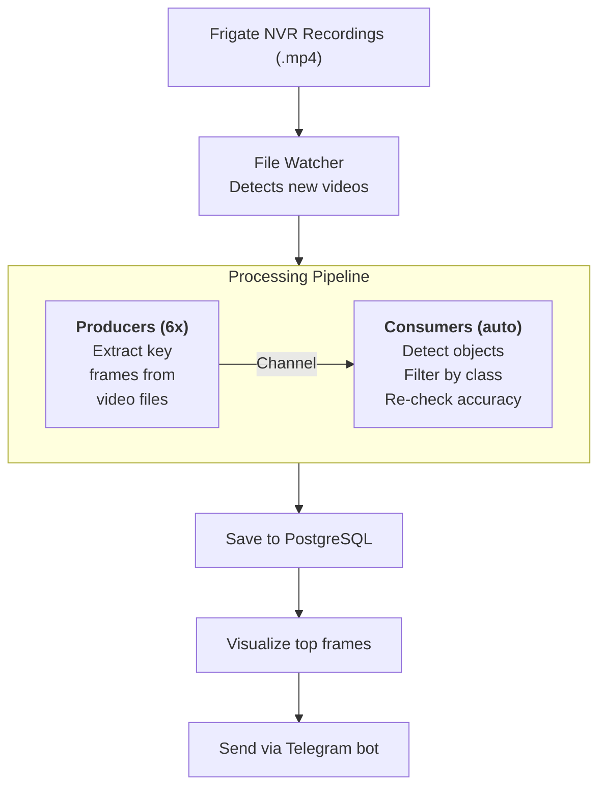

# Frigate Analyzer

Automated video recording analysis for [Frigate NVR](https://frigate.video/) security cameras using YOLO-based object detection. Watches for new recordings, extracts key frames, detects objects, and sends Telegram notifications with annotated images.

## How It Works



Frame extraction, object detection, and video annotation are performed by an external [vision-api-server](https://github.com/zinin/vision-api-server) — a Python service wrapping Ultralytics YOLO models.

## Features

- **Automatic recording processing** — watches Frigate recording directories, extracts key frames using scene detection, runs object detection on each frame
- **Multi-server load balancing** — distributes detection workload across multiple vision-api-server instances with priority-based scheduling and health monitoring
- **Two-stage detection** — initial fast scan with a lightweight model, then re-checks detected objects with a higher-accuracy model for validation
- **Configurable object filtering** — only keep detections for classes you care about (person, car, dog, etc.)
- **Telegram bot** — real-time notifications with annotated images, video export (raw or with bounding boxes), user management, timezone support
- **Reactive stack** — built on Spring WebFlux, R2DBC, and Kotlin Coroutines for non-blocking I/O throughout

## Prerequisites

| Component | Purpose |
|-----------|---------|
| [Frigate NVR](https://frigate.video/) | Generates video recordings from security cameras |
| [vision-api-server](https://github.com/zinin/vision-api-server) | YOLO-based detection service (frame extraction, object detection, visualization) |
| PostgreSQL 15+ | Stores recordings, detections, and user data |
| Telegram Bot Token | Obtain from [@BotFather](https://t.me/BotFather) |
| Docker + Docker Compose | For deployment |

## Quick Start

### 1. Clone the repository

```bash
git clone https://github.com/zinin/frigate-analyzer.git
cd frigate-analyzer/docker/deploy
```

### 2. Configure environment

```bash
cp .env.example .env
cp application-docker.yaml.example application-docker.yaml
```

Edit `.env`:

```env
# Database
DB_HOST=192.168.1.100
DB_PORT=5432
DB_NAME=frigate_analyzer
DB_USER=frigate_analyzer_rw
DB_PASS=your-db-password

# Telegram
TELEGRAM_BOT_TOKEN=your-bot-token
TELEGRAM_OWNER=your-telegram-username

# Frigate recordings path
FRIGATE_RECORDS_FOLDER=/mnt/data/frigate/recordings
```

Edit `application-docker.yaml` to configure your detection servers (see [Detection Servers](#detection-servers)).

### 3. Start services

```bash
docker compose up -d
```

This starts two containers:
- **frigate-analyzer-liquibase** — runs database migrations, then exits
- **frigate-analyzer** — the main application

### 4. Activate the Telegram bot

Open your bot in Telegram and send `/start`. As the configured owner, you'll be automatically authorized.

## Configuration

All settings use environment variables with sensible defaults. Key variables:

### Core

| Variable | Default | Description |
|----------|---------|-------------|
| `FRIGATE_RECORDS_FOLDER` | `/mnt/data/frigate/recordings` | Path to Frigate recordings |
| `DISABLE_FIRST_SCAN` | `false` | Skip initial directory scan on startup |
| `WATCH_PERIOD` | `P1D` | ISO-8601 duration — how far back to watch for recordings |
| `FFMPEG_PATH` | `/usr/bin/ffmpeg` | Path to ffmpeg binary |

### Database

| Variable | Default | Description |
|----------|---------|-------------|
| `DB_HOST` | `localhost` | PostgreSQL host |
| `DB_PORT` | `5432` | PostgreSQL port |
| `DB_NAME` | `frigate_analyzer` | Database name |
| `DB_USER` | `frigate_analyzer_rw` | Username |
| `DB_PASS` | `frigate_analyzer_rw` | Password |

### Telegram

| Variable | Default | Description |
|----------|---------|-------------|
| `TELEGRAM_BOT_TOKEN` | *(required)* | Bot token from @BotFather |
| `TELEGRAM_OWNER` | *(required)* | Owner's Telegram username (without @) |
| `TELEGRAM_ENABLED` | `true` | Enable/disable the bot |
| `TELEGRAM_PROXY_HOST` | *(empty)* | SOCKS5 proxy host (if needed) |
| `TELEGRAM_PROXY_PORT` | `1080` | SOCKS5 proxy port |

### Detection

| Variable | Default | Description |
|----------|---------|-------------|
| `DETECT_DEFAULT_CONFIDENCE` | `0.6` | Confidence threshold |
| `DETECT_DEFAULT_IMG_SIZE` | `2016` | Image size for inference |
| `DETECT_DEFAULT_MODEL` | `yolo26s.pt` | Fast model for initial scan |
| `DETECT_GOOD_MODEL` | `yolo26x.pt` | Accurate model for re-check |
| `DETECTION_FILTER_CLASSES` | `person,car,motorcycle,...` | Allowed object classes (comma-separated) |

### Pipeline

| Variable | Default | Description |
|----------|---------|-------------|
| `PIPELINE_FRAME_PRODUCERS_COUNT` | `6` | Number of producer coroutines |
| `PIPELINE_FRAME_BUFFER_SIZE` | `500` | Channel buffer capacity |
| `PIPELINE_BATCH_SIZE` | `10` | Recordings per producer batch |

## Detection Servers

Detection is performed by one or more [vision-api-server](https://github.com/zinin/vision-api-server) instances. Configure them in `application-docker.yaml`:

```yaml
application:
  detect-servers:
    gpu-server:
      host: 192.168.1.50
      port: 3001
      frame-requests:
        simultaneous-count: 4    # concurrent frame detections
        priority: 1              # lower = preferred
      frames-extract-requests:
        simultaneous-count: 1    # concurrent video frame extractions
        priority: 3
      visualize-requests:
        simultaneous-count: 1    # concurrent frame visualizations
        priority: 1
      video-visualize-requests:
        simultaneous-count: 1    # concurrent video annotations
        priority: 1
```

You can define multiple servers — the load balancer distributes requests based on current load and priority. The number of pipeline consumer coroutines is auto-scaled to match total server capacity.

## Telegram Bot

### Commands

| Command | Description | Access |
|---------|-------------|--------|
| `/start` | Activate bot subscription | Everyone |
| `/help` | Show available commands | Authorized users |
| `/export` | Export camera video (interactive dialog) | Authorized users |
| `/timezone` | Set your timezone | Authorized users |
| `/version` | Show build and version info | Authorized users |
| `/adduser` | Invite a user (by @username) | Owner only |
| `/removeuser` | Remove a user | Owner only |
| `/users` | List all registered users | Owner only |

### Video Export

The `/export` command starts an interactive dialog:

1. **Select date** — today, yesterday, or enter a custom date
2. **Select time range** — e.g., `9:15-9:20` (max 5 minutes)
3. **Select camera** — from cameras with recordings in that period
4. **Select mode:**
   - **Original** — raw merged video
   - **Annotated** — video with detection bounding boxes overlaid (processed by vision-api-server)

### Notifications

When objects are detected in a recording, the bot sends a notification with:
- Camera name and timestamp
- Number of detected objects per class
- Top frames annotated with bounding boxes and confidence scores

## API

| Endpoint | Description |
|----------|-------------|
| `GET /frigate-analyzer/actuator/health` | Health check |
| `GET /frigate-analyzer/swagger-ui/index.html` | Swagger UI |

## Building from Source

### Requirements

- JDK 25 ([Azul Zulu](https://www.azul.com/downloads/) recommended)
- Docker (for test database via Testcontainers)

### Build

```bash
./gradlew build
```

### Run tests

```bash
./gradlew test
```

### Run locally

1. Start the development database:
   ```bash
   cd docker && docker compose up -d
   ```

2. Create `modules/core/src/main/resources/application-local.yaml` with your settings (detection servers, Telegram token, etc.)

3. Run the application with the `local` Spring profile.

### Project Structure

```
modules/
├── common/      # Utilities (UUID generation, clock)
├── model/       # Entities, DTOs, request/response types
├── service/     # Business logic, repositories, MapStruct mappers
├── telegram/    # Telegram bot, notifications, user management
└── core/        # Spring Boot app, controllers, pipeline, detection
```

Module dependencies: `core` → `telegram` → `service` → `model` → `common`

## Tech Stack

- **Kotlin 2.3.10** + **Coroutines** + **Channels**
- **Spring Boot 4.0** + **WebFlux** (reactive)
- **R2DBC** + **PostgreSQL** (non-blocking database access)
- **Liquibase** (database migrations)
- **MapStruct** (entity mapping)
- **ktgbotapi** (Telegram bot)
- **Java 25** with AOT cache for fast startup

## License

Copyright (C) 2026 Alexander Zinin <mail@zinin.ru>

Licensed under the GNU Affero General Public License v3.0 or later
(AGPL-3.0-or-later). See `LICENSE`.
