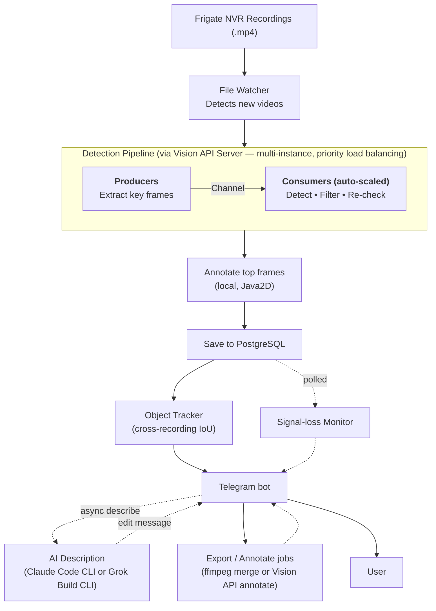

# Frigate Analyzer

Automated video recording analysis for [Frigate NVR](https://frigate.video/) security cameras using YOLO-based object detection. Watches for new recordings, extracts key frames, detects objects, and sends Telegram notifications with annotated images.

## How It Works


```mermaid
graph TD
    A["Frigate NVR Recordings (.mp4)"] --> B["File Watcher<br/>Detects new videos"]
    B --> C

    subgraph C ["Detection Pipeline (via Vision API Server — multi-instance, priority load balancing)"]
        direction LR
        P["<b>Producers</b><br/>Extract key frames"] -- "Channel" --> Q["<b>Consumers (auto-scaled)</b><br/>Detect • Filter • Re-check"]
    end

    C --> VIS["Annotate top frames<br/>(local, Java2D)"]
    VIS --> D["Save to PostgreSQL"]
    D --> E["Object Tracker<br/>(cross-recording IoU)"]
    E --> F["Telegram bot"]

    D -. "polled" .-> SL["Signal-loss Monitor"]
    SL -.-> F

    F -. "async describe" .-> AI["AI Description<br/>(Claude Code CLI or Grok Build CLI)"]
    AI -. "edit message" .-> F

    F --> EX["Export / Annotate jobs<br/>(ffmpeg merge or Vision API annotate)"]
    EX -.-> F
    F --> U["User"]
```

Frame extraction, object detection, and video annotation are performed by an external [vision-api-server](https://github.com/zinin/vision-api-server) — a Python service wrapping Ultralytics YOLO models.

## Features

- **Automatic recording processing** — watches Frigate recording directories, extracts key frames using scene detection, runs object detection on each frame
- **Multi-server load balancing** — distributes detection workload across multiple vision-api-server instances with priority-based scheduling and health monitoring
- **Two-stage detection** — initial fast scan with a lightweight model, then re-checks detected objects with a higher-accuracy model for validation
- **Configurable object filtering** — only keep detections for classes you care about (person, car, dog, etc.)
- **Object tracking** — cross-recording IoU matching suppresses duplicate notifications when the same object lingers across consecutive recordings
- **Signal-loss detection** — polls the database for last recording per camera and alerts (Telegram) on signal loss / recovery
- **AI description (optional)** — generates short and detailed natural-language descriptions of detections via Claude Code CLI or Grok Build CLI, edited into the notification message
- **Telegram bot** — real-time notifications with annotated images, inline quick-export buttons, video export (raw or annotated), per-user and global notification toggles, timezone support, user management
- **Reactive stack** — built on Spring WebFlux, R2DBC, and Kotlin Coroutines for non-blocking I/O throughout

## Prerequisites

| Component | Purpose |
|-----------|---------|
| [Frigate NVR](https://frigate.video/) | Generates video recordings from security cameras |
| [vision-api-server](https://github.com/zinin/vision-api-server) | YOLO-based detection service (frame extraction, object detection, visualization) |
| PostgreSQL 15+ | Stores recordings, detections, and user data |
| Telegram Bot Token | Obtain from [@BotFather](https://t.me/BotFather) |
| Docker + Docker Compose | For deployment |
| Claude Code CLI or Grok Build CLI *(optional)* | Required only if `APP_AI_DESCRIPTION_ENABLED=true`; the image installs both, and each declared preset picks one. Locally: `claude setup-token` or `grok login --device-code` |

## Quick Start

### 1. Clone the repository

```bash
git clone https://github.com/zinin/frigate-analyzer.git
cd frigate-analyzer/docker/deploy
```

### 2. Configure environment

```bash
cp .env.example .env
cp application-docker.yaml.example application-docker.yaml
```

Edit `.env`:

```env
# Database
DB_HOST=192.168.1.100
DB_PORT=5432
DB_NAME=frigate_analyzer
DB_USER=frigate_analyzer_rw
DB_PASS=your-db-password

# Telegram
TELEGRAM_BOT_TOKEN=your-bot-token
TELEGRAM_OWNER=your-telegram-username

# Frigate recordings path
FRIGATE_RECORDS_FOLDER=/mnt/data/frigate/recordings
```

Edit `application-docker.yaml` to configure your detection servers (see [Detection Servers](#detection-servers)).

### 3. Start services

```bash
docker compose up -d
```

This starts two containers:
- **frigate-analyzer-liquibase** — runs database migrations, then exits
- **frigate-analyzer** — the main application (port `8080` by default; override with `HOST_PORT`)

### 4. Activate the Telegram bot

Open your bot in Telegram and send `/start`. As the configured owner, you'll be automatically authorized.

## Configuration

All settings use environment variables with sensible defaults. Key variables:

### Core

| Variable | Default | Description |
|----------|---------|-------------|
| `FRIGATE_RECORDS_FOLDER` | `/mnt/data/frigate/recordings` | Path to Frigate recordings |
| `DISABLE_FIRST_SCAN` | `true` | Startup scan is an opt-in backfill — set to `false` to run it once |
| `WATCH_PERIOD` | `P1D` | ISO-8601 duration — how far back to watch for recordings |
| `FIRST_SCAN_PERIOD` | = `WATCH_PERIOD`, truncated to whole days | ISO-8601 duration — how far back the startup backfill indexes files (whole days, UTC; `P0D` = today only) |
| `FFMPEG_PATH` | `/usr/bin/ffmpeg` | Path to ffmpeg binary |
| `FFPROBE_PATH` | `/usr/bin/ffprobe` | Path to ffprobe binary — reads the parameters of an export before it is re-encoded to fit the Telegram 50 MB limit |
| `EXPORT_COMPRESS_PRESET` | `fast` | libx264 preset for that re-encode (`ultrafast` … `placebo`): speed versus compression |
| `EXPORT_COMPRESS_CRF` | `23` | libx264 quality target (0–51) for that re-encode; the bitrate cap from the size budget still applies |
| `EXPORT_COMPRESS_MIN_BITS_PER_PIXEL` | `0.1` | Smallest bits-per-pixel a candidate height (1080/720/540, never above the source) may have before the next smaller one is tried |

### Database

| Variable | Default | Description |
|----------|---------|-------------|
| `DB_HOST` | `localhost` | PostgreSQL host |
| `DB_PORT` | `5432` | PostgreSQL port |
| `DB_NAME` | `frigate_analyzer` | Database name |
| `DB_USER` | `frigate_analyzer_rw` | Username |
| `DB_PASS` | `frigate_analyzer_rw` | Password |

### Telegram

| Variable | Default | Description |
|----------|---------|-------------|
| `TELEGRAM_BOT_TOKEN` | *(required)* | Bot token from @BotFather |
| `TELEGRAM_OWNER` | *(required)* | Owner's Telegram username (without @) |
| `TELEGRAM_ENABLED` | `true` | Enable/disable the bot |
| `TELEGRAM_PROXY_HOST` | *(empty)* | SOCKS5 proxy host (if needed) |
| `TELEGRAM_PROXY_PORT` | `1080` | SOCKS5 proxy port |

### Detection

| Variable | Default | Description |
|----------|---------|-------------|
| `DETECT_DEFAULT_CONFIDENCE` | `0.6` | Confidence threshold |
| `DETECT_DEFAULT_IMG_SIZE` | `2016` | Image size for inference |
| `DETECT_DEFAULT_MODEL` | `yolo26s.pt` | Fast model for initial scan |
| `DETECT_GOOD_MODEL` | `yolo26x.pt` | Accurate model for re-check |
| `DETECTION_FILTER_CLASSES` | `person,car,motorcycle,...` | Allowed object classes (comma-separated) |

### Pipeline

| Variable | Default | Description |
|----------|---------|-------------|
| `PIPELINE_FRAME_PRODUCERS_COUNT` | `6` | Number of producer coroutines |
| `PIPELINE_FRAME_BUFFER_SIZE` | `500` | Channel buffer capacity |
| `PIPELINE_BATCH_SIZE` | `10` | Recordings per producer batch |

### Signal-loss detection

| Variable | Default | Description |
|----------|---------|-------------|
| `SIGNAL_LOSS_ENABLED` | `true` | Master switch for the camera signal-loss monitor |
| `SIGNAL_LOSS_THRESHOLD` | `3m` | Gap that triggers a "signal lost" alert |
| `SIGNAL_LOSS_POLL_INTERVAL` | `30s` | Detector tick period (must be < threshold) |
| `SIGNAL_LOSS_ACTIVE_WINDOW` | `24h` | Camera ages out of monitoring after this. **Must be ≥ Frigate retention.** |
| `SIGNAL_LOSS_STARTUP_GRACE` | `5m` | Alerts deferred for this window after boot |

### AI description (optional)

When enabled, generates a short and a detailed natural-language description of detections and edits
them into the notification. Two providers: the Claude Code CLI (`claude`) and the xAI Grok Build CLI
(`grok`). Both binaries ship in the image.

| Variable | Default | Description |
|----------|---------|-------------|
| `APP_AI_DESCRIPTION_ENABLED` | `false` | Master switch |
| `APP_AI_DESCRIPTION_DEFAULT_PRESET` | *(empty)* | Preset that is active until the owner picks one in `/ai`; empty = the first usable preset |
| `APP_AI_DESCRIPTION_PROVIDER` | `claude` | Single-preset path only — `claude` or `grok`, used while no `presets` map is declared |
| `APP_AI_DESCRIPTION_LANGUAGE` | `en` | `ru` or `en` |
| `APP_AI_DESCRIPTION_TIMEOUT` | `60s` | Per-call budget for the model and the agent's retries — see "Timeout ceiling" below |
| `APP_AI_DESCRIPTION_MAX_CONCURRENT` | `2` | Max simultaneous model requests |
| `APP_AI_DESCRIPTION_RATE_LIMIT_MAX` | `10` | Max invocations per sliding window |
| `APP_AI_DESCRIPTION_RATE_LIMIT_WINDOW` | `1h` | Sliding-window length |
| `CLAUDE_CODE_OAUTH_TOKEN` | *(required for claude)* | Token from `claude setup-token` |
| `CLAUDE_MODEL` | `opus` | `opus` / `sonnet` / `haiku`; single-preset path only |
| `CLAUDE_MAX_BUFFER_SIZE` | `16MB` | Max size of one JSON message from the Claude CLI. Frames the model reads are echoed back as base64, so raise it for cameras with frames above ~12 MB |
| `GROK_MODEL` | `grok-4.6` | Model id, or a BYOK model name from `grok-home/config.toml`; single-preset path only |
| `GROK_EFFORT` | `low` | Reasoning effort; empty = not passed; single-preset path only |
| `GROK_PASS_THROUGH_ENV` | *(empty)* | Extra env variable names handed to `grok` verbatim; needed for a BYOK `env_key` outside `GROK_*`/`XAI_*` |

**Presets.** Declare as many named presets as you like in `application-docker.yaml`; each one is a
provider, a model and (for `grok`) a reasoning effort:

```yaml
application:
  ai:
    description:
      default-preset: ${APP_AI_DESCRIPTION_DEFAULT_PRESET:grok-fast}
      presets:
        grok-fast:   { provider: grok,   model: grok-4.6,   effort: low }
        grok-deep:   { provider: grok,   model: grok-4.6,   effort: xhigh }
        claude-opus: { provider: claude, model: opus }
```

The owner switches the active preset in `/ai`, one tap, no restart — the screen also turns
descriptions off and back on, and shows the authorization state of every credential scope in use.
The choice is stored in the database, so it survives a restart; `default-preset` decides only until
that first tap and stops mattering afterwards. A preset whose provider is not configured (no token,
an unwritable directory) stays on the screen, marked, and cannot be selected. The startup log names
the whole catalog with values — `Description presets: grok-fast (grok/grok-4.6/low), claude-opus
(claude/opus); default 'grok-fast'` — and the first time a preset is actually resolved (a
description, or opening `/ai`) one more INFO line names the running preset and whether the choice
came from the owner or from `default-preset`.

The `presets` map replaces `APP_AI_DESCRIPTION_PROVIDER`, `GROK_MODEL`, `GROK_EFFORT` and
`CLAUDE_MODEL`: while the map is empty those four still describe a single preset, and declaring the
map turns them off. `ANTHROPIC_MODEL`, when set, still displaces the model of every `claude` preset —
`/ai` shows the model that will actually be used.

**Timeout ceiling.** `APP_AI_DESCRIPTION_TIMEOUT` has to cover the *slowest* declared preset, not the
typical one. `grok-4.6` at `effort: xhigh` takes ~48 s, which leaves nothing inside the default 60 s
for a retry: the transport retry (10 s of budget plus a 5 s pause) never starts, and the
invalid-response retry (5 s) starts and then dies on the outer timeout, turning an honest
`InvalidResponse` into a misleading `Timeout`. Startup logs a WARN for such a preset recommending
`APP_AI_DESCRIPTION_TIMEOUT=120s`, and `/ai` marks it with 🐢. The timeout is a give-up point, not a
duration, so 120 s does not slow `grok-fast` (~9 s) down; the only cost is that a hung call is
noticed later. Pick it once, when you declare the presets — switching between them afterwards needs
no restart.

Capacity is the other side of that: two `xhigh` calls occupy both slots of the default
`APP_AI_DESCRIPTION_MAX_CONCURRENT=2` for ~48 s, and a third recording gives up on
`APP_AI_DESCRIPTION_QUEUE_TIMEOUT` and goes out without a description.

**Grok sign-in.** Grok uses your SuperGrok subscription, no API key. Once, on the host:

```bash
mkdir -p grok-home && sudo chown 1000:1000 grok-home   # compose would create it as root otherwise
docker compose up -d
docker compose exec frigate-analyzer grok login --device-code
```

Open the printed URL, enter the code. `grok-home/auth.json` then refreshes itself; never copy it from
another machine, the refresh token rotates and only one copy survives. If the credentials stop
working, the bot owner receives a Telegram message with the command to run.

**Custom models (BYOK).** Put a `[model.<name>]` section with `model`, `base_url` and `env_key` into
`grok-home/config.toml`, put the key into `.env`, set `GROK_MODEL=<name>` and an empty
`GROK_EFFORT`. The `grok` process starts from an empty environment and inherits only PATH/HOME/locale
and `GROK_*`/`XAI_*`, so a key named outside those prefixes also needs
`GROK_PASS_THROUGH_ENV=MY_GATEWAY_KEY`; naming it `GROK_MY_GATEWAY_KEY` works without the list.

Full list of variables (notification dedup, ffmpeg tuning, detection thresholds, etc.) lives in
[`.claude/rules/configuration.md`](.claude/rules/configuration.md) and `docker/deploy/.env.example`.

## Detection Servers

Detection is performed by one or more [vision-api-server](https://github.com/zinin/vision-api-server) instances. Configure them in `application-docker.yaml`:

```yaml
application:
  detect-servers:
    gpu-server:
      host: 192.168.1.50
      port: 3001
      frame-requests:
        simultaneous-count: 4    # concurrent frame detections
        priority: 1              # lower = preferred
      frames-extract-requests:
        simultaneous-count: 1    # concurrent video frame extractions
        priority: 3
      visualize-requests:
        simultaneous-count: 1    # concurrent frame visualizations
        priority: 1
      video-visualize-requests:
        simultaneous-count: 1    # concurrent video annotations
        priority: 1
```

You can define multiple servers — the load balancer distributes requests based on current load and priority. The number of pipeline consumer coroutines is auto-scaled to match total server capacity.

## Telegram Bot

### Commands

| Command | Description | Access |
|---------|-------------|--------|
| `/start` | Activate bot subscription | Everyone |
| `/help` | Show available commands | Authorized users |
| `/export` | Export camera video (interactive dialog) | Authorized users |
| `/timezone` | Set your timezone | Authorized users |
| `/language` | Set your interface language (ru / en) | Authorized users |
| `/notifications` | Toggle recording / signal-loss notifications (per-user; OWNER also toggles global) | Authorized users |
| `/version` | Show build and version info | Authorized users |
| `/status` | Snapshot of recordings, cameras, and detect-servers state | Owner only |
| `/ai` | Switch the active AI-description preset; turn descriptions on and off | Owner only |
| `/adduser` | Invite a user (by @username) | Owner only |
| `/removeuser` | Remove a user | Owner only |
| `/users` | List all registered users | Owner only |

### Video Export

There are two ways to export video:

**Interactive `/export` dialog:**
1. **Select date** — today, yesterday, or enter a custom date
2. **Select time range** — e.g., `9:15-9:20` (max 5 minutes)
3. **Select camera** — from cameras with recordings in that period
4. **Select mode:**
   - **Original** — raw merged video
   - **Annotated** — video with detection bounding boxes overlaid (processed by vision-api-server)

**Quick Export from notifications** — every detection notification ships with two inline buttons ("Original" / "Annotated") that export ±1 minute around the recording (2 minutes total).

Both flows support a cancel button — pressing it stops the merge or annotation job (best-effort for ffmpeg merge, immediate cancel for vision-server annotation jobs).

### Notifications

When objects are detected in a recording, the bot sends a notification with:
- Camera name and timestamp
- Number of detected objects per class
- Top frames annotated with bounding boxes and confidence scores
- Inline "Original" / "Annotated" buttons for instant quick-export (±1 min around the recording)

If AI description is enabled, the message first carries placeholders; once the description provider responds, the short description paragraph and a collapsible detailed description (`<details>`) are edited into the same message.

### Signal-loss alerts

A background monitor polls the database for the latest recording per camera. When `now - lastRecording > SIGNAL_LOSS_THRESHOLD` the bot sends a "signal lost" alert; on recovery — a "signal restored" alert. Active cameras are scoped by `SIGNAL_LOSS_ACTIVE_WINDOW` (should match Frigate's retention). Per-user opt-out via `/notifications`.

## API

| Endpoint | Description |
|----------|-------------|
| `GET /frigate-analyzer/actuator/health` | Health check (used by Docker healthcheck) |
| `GET /frigate-analyzer/status` | JSON snapshot of recordings / cameras / detect-servers |
| `GET /frigate-analyzer/version` | Plain-text build version |
| `GET /frigate-analyzer/swagger-ui/index.html` | Swagger UI |

## Building from Source

### Requirements

- JDK 25 ([Azul Zulu](https://www.azul.com/downloads/) recommended) — Gradle's Java toolchain auto-downloads it on first build if missing
- Docker (for the test database via Testcontainers)

### Build

```bash
./gradlew build
```

### Run tests

```bash
./gradlew test
```

### Run locally

1. Start the development database:
   ```bash
   cd docker && docker compose up -d
   ```

2. Create `modules/core/src/main/resources/application-local.yaml` with your settings (detection servers, Telegram token, etc.)

3. Run the application with the `local` Spring profile.

### Project Structure

```
modules/
├── common/         # Utilities (UUID generation, clock)
├── model/          # Entities, DTOs, request/response types
├── service/        # Business logic, repositories, MapStruct mappers
├── ai-description/ # AI-generated detection descriptions via Claude Code SDK or Grok Build CLI
├── telegram/       # Telegram bot, notifications, user management
└── core/           # Spring Boot app, controllers, pipeline, detection, signal-loss
```

Module dependencies: main chain `core` → `telegram` → `service` → `model` → `common`; `ai-description` is an independent module pulled in by both `core` and `telegram`.

## Tech Stack

- **Kotlin 2.3.21** + **Coroutines** + **Channels**
- **Spring Boot 4.0.6** + **WebFlux** (reactive)
- **R2DBC** + **PostgreSQL** (non-blocking database access)
- **Liquibase 5** (database migrations)
- **MapStruct** (entity mapping)
- **ktgbotapi 33** (Telegram bot)
- **Jackson 3** (`tools.jackson.*`)
- **Claude Code SDK** or **Grok Build CLI** (optional AI description)
- **Java 25** with AOT cache for fast startup

## License

Copyright (C) 2026 Alexander Zinin <mail@zinin.ru>

Licensed under the GNU Affero General Public License v3.0 or later
(AGPL-3.0-or-later). See `LICENSE`.
