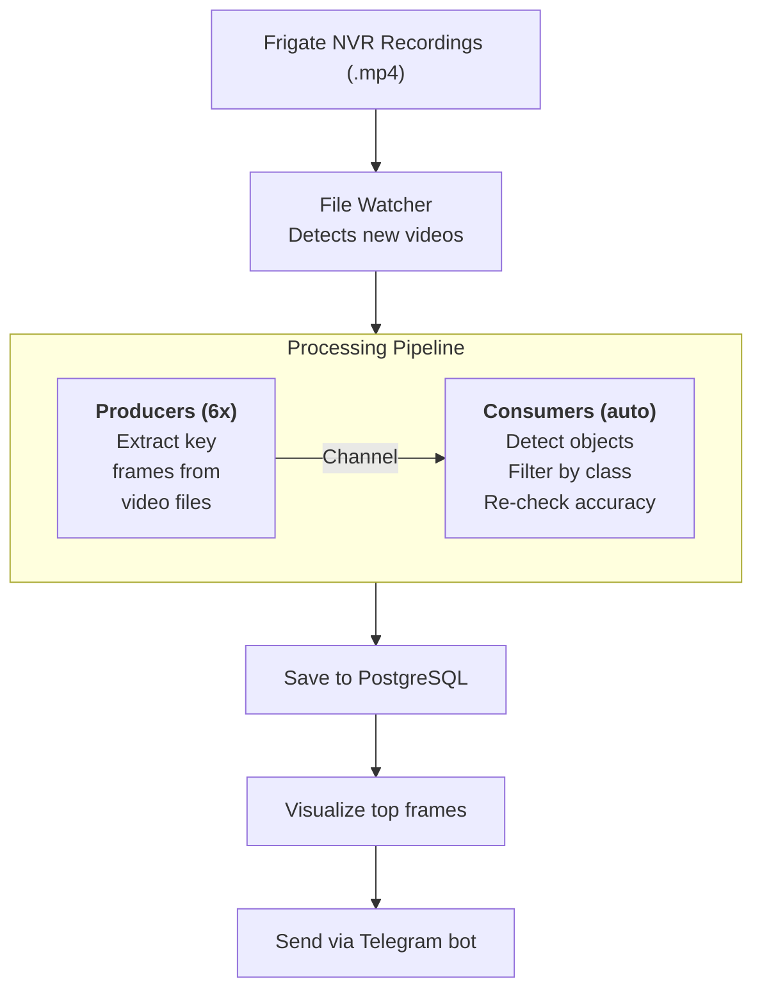
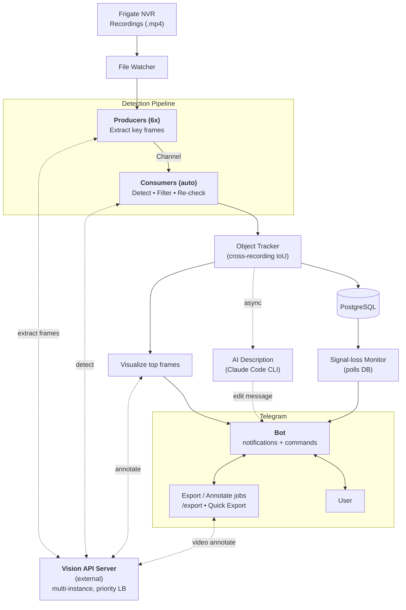

# How It Works Diagram Refresh — Implementation Plan

> **For agentic workers:** REQUIRED SUB-SKILL: Use superpowers:subagent-driven-development (recommended) or superpowers:executing-plans to implement this plan task-by-task. Steps use checkbox (`- [ ]`) syntax for tracking.

**Goal:** Replace outdated mermaid diagram in `README.md` "How It Works" section with refreshed version showing subsystems shipped since 2026-03-03 (multi-server LB, two-stage detection, object tracking, signal-loss, AI description, two-way Telegram with export jobs).

**Architecture:** Documentation-only change to one mermaid block inside `README.md`. New diagram uses `subgraph` grouping for Detection Pipeline and Telegram, places Vision API Server as a single external node with dotted bidirectional arrows to four stages (extract / detect / visualize / video-annotate), and adds explicit branches for the signal-loss monitor and AI description.

**Tech Stack:** Mermaid (GitHub-flavored markdown rendering).

**Spec:** `docs/superpowers/specs/2026-05-26-howitworks-diagram-refresh-design.md`

---

## Task 1: Replace the mermaid diagram

**Files:**
- Modify: `README.md` (the `## How It Works` section, mermaid block currently at lines 7-21)

- [ ] **Step 1: Confirm the exact boundaries of the current mermaid block**

Run: Read `README.md` lines 1-25 to confirm the current diagram still starts at line 7 (the `\`\`\`mermaid` fence) and ends at line 21 (the closing `\`\`\``). If line numbers differ (e.g. because of a recent commit), use the new numbers in Step 2.

Expected: lines 7-21 contain the existing mermaid block with `graph TD`, `subgraph C ["Processing Pipeline"]`, and the linear `Recordings → Watcher → Producers→Consumers → DB → Visualize → Telegram` flow.

- [ ] **Step 2: Replace the mermaid block via Edit**

Use the Edit tool on `README.md`.

`old_string` (the whole existing mermaid block, including fences):

````

````

`new_string` (the refreshed mermaid block, including fences):

````

````

- [ ] **Step 3: Verify the surrounding text in README is intact**

Run: Read `README.md` lines 1-30 again. Confirm:
- Line 1: `# Frigate Analyzer`
- The diagram is followed by the paragraph starting with `Frame extraction, object detection, and video annotation are performed by an external [vision-api-server]...` (this paragraph is unchanged per spec § Out of Scope)
- The `## Features` section follows the paragraph

Expected: only the mermaid block changed, nothing else.

- [ ] **Step 4: Render the diagram to verify mermaid syntax**

Render the updated `README.md` in any of:
- GitHub preview (push the branch and view on github.com)
- VS Code Markdown preview with Mermaid extension
- https://mermaid.live (paste the new block)

Expected outcome:
- 13 nodes visible: `A`, `B`, `P`, `Q`, `V`, `OT`, `DB`, `VIS`, `AI`, `SL`, `BOT`, `EX`, `U`
- Two subgraphs render with borders/labels: "Detection Pipeline" (LR direction) and "Telegram" (TB direction)
- Vision API Server (`V`) sits outside both subgraphs and has dotted bidirectional arrows to `P`, `Q`, `VIS`, and `EX`
- Signal-loss branch (`DB → SL → BOT`) and AI description branch (`OT ⇢ AI ⇢ BOT`) are present
- Telegram subgraph contains `BOT ↔ U` and `BOT ↔ EX`
- No mermaid parse errors

If any of these fail, fix the diagram before continuing.

- [ ] **Step 5: Stage and commit**

```bash
git add README.md
git commit -m "$(cat <<'EOF'
docs(readme): refresh How It Works diagram

Reflect subsystems shipped since the original diagram (2026-03-03):
- Vision API Server as a single external block (multi-instance, LB)
  linked to Producers (extract), Consumers (detect), Visualize
  (annotate) and Export jobs (video annotate).
- Object Tracker between Consumers and DB (cross-recording IoU).
- Signal-loss Monitor branch (polls DB -> Bot).
- AI Description branch (Claude CLI -> edit message, async).
- Two-way Telegram with Export / Annotate jobs (/export, Quick Export).

Layout uses subgraph grouping for Detection Pipeline and Telegram.
EOF
)"
```

Expected: `[docs/refresh-howitworks-diagram <hash>] docs(readme): refresh How It Works diagram | 1 file changed, ...`.

---

## Task 2: Drop plan & spec docs before opening the PR

Per `~/.claude/CLAUDE.md`: documents under `docs/superpowers/` must not appear in the PR diff. They remain accessible in branch git history.

**Do this task only when the PR is about to be opened** — keeping the docs in the branch while review/feedback iterates is fine.

**Files:**
- Delete: `docs/superpowers/specs/2026-05-26-howitworks-diagram-refresh-design.md`
- Delete: `docs/superpowers/plans/2026-05-26-howitworks-diagram-refresh.md`

- [ ] **Step 1: Remove both docs via `git rm`**

```bash
git rm docs/superpowers/specs/2026-05-26-howitworks-diagram-refresh-design.md \
       docs/superpowers/plans/2026-05-26-howitworks-diagram-refresh.md
```

Expected: `rm 'docs/superpowers/specs/...'` and `rm 'docs/superpowers/plans/...'` printed; both files disappear from working tree.

- [ ] **Step 2: Commit the cleanup**

```bash
git commit -m "chore: drop plan docs before PR"
```

Expected: a commit titled `chore: drop plan docs before PR` with 2 files deleted.

- [ ] **Step 3: Verify final state**

```bash
git log --oneline master..HEAD
git status --short
```

Expected:
- `git log` shows exactly two commits ahead of master:
  - `<hash> chore: drop plan docs before PR`
  - `<hash> docs(readme): refresh How It Works diagram`
  - (the older `docs: design refresh of How It Works diagram` commit also lists)
- `git status` shows no tracked changes (untracked files like `.codex`, `tmp/` are fine — they were there before this branch).

---

## Self-Review

**Spec coverage:**
- Spec § Mermaid-код → Task 1 Step 2 (`new_string` is the same block) ✓
- Spec § Ключевые потоки на диаграмме (5 потоков) → all visible in Task 1 Step 4 render-check criteria ✓
- Spec § Соответствие коду (11 code references) → all 11 are nodes or subgraph members in Task 1 Step 2 ✓
- Spec § Out of Scope (no other README/code/rules changes) → enforced by Task 1 Step 3 ✓
- CLAUDE.md global rule on `docs/superpowers/` not in PR → Task 2 ✓

**Placeholder scan:**
- No "TBD", "TODO", "implement later", "fill in details" — all code/commands are concrete ✓
- No "Add appropriate error handling" / "handle edge cases" — N/A for docs ✓
- No "similar to Task N" — Task 2 spells out its own commands ✓

**Type consistency:** Single-file documentation change, no API surface. The mermaid `new_string` is literally the spec's mermaid block (byte-for-byte). ✓

**Other notes:**
- No build/test commands needed — this is markdown documentation. ktlint / gradle build are not affected.
- No code-review skill needed — this is a one-file doc change; visual render verification in Task 1 Step 4 is the review.
