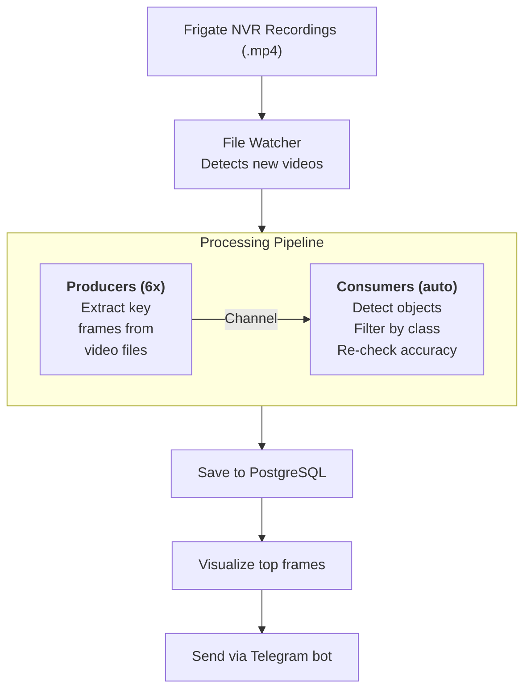
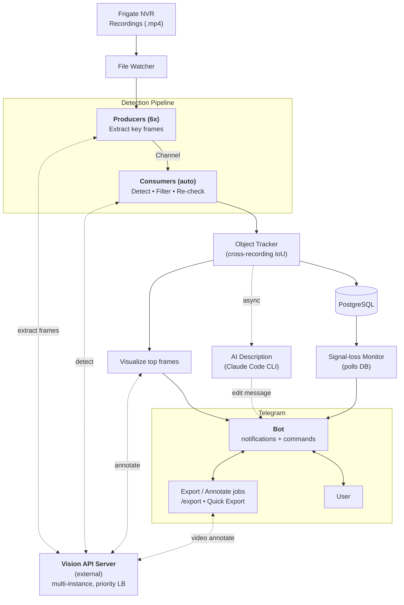

# How It Works Diagram Refresh — Implementation Plan

> **For agentic workers:** REQUIRED SUB-SKILL: Use superpowers:subagent-driven-development (recommended) or superpowers:executing-plans to implement this plan task-by-task. Steps use checkbox (`- [ ]`) syntax for tracking.

**Goal:** Replace outdated mermaid diagram in `README.md` "How It Works" section with refreshed version showing subsystems shipped since 2026-03-03 (multi-server LB, two-stage detection, object tracking, signal-loss, AI description, two-way Telegram with export jobs).

**Architecture:** Documentation-only change to one mermaid block inside `README.md`. New diagram uses `subgraph` grouping for Detection Pipeline and Telegram, places Vision API Server as a single external node with dotted bidirectional arrows to four stages (extract / detect / visualize / video-annotate), and adds explicit branches for the signal-loss monitor and AI description.

**Tech Stack:** Mermaid (GitHub-flavored markdown rendering).

**Spec:** `docs/superpowers/specs/2026-05-26-howitworks-diagram-refresh-design.md`

---

## Task 1: Replace the mermaid diagram

**Files:**
- Modify: `README.md` (the `## How It Works` section, mermaid block currently at lines 7-21)

- [ ] **Step 1: Confirm the exact boundaries of the current mermaid block**

Run: Read `README.md` lines 1-25 to confirm the current diagram still starts at line 7 (the `\`\`\`mermaid` fence) and ends at line 21 (the closing `\`\`\``). If line numbers differ (e.g. because of a recent commit), use the new numbers in Step 2.

Expected: lines 7-21 contain the existing mermaid block with `graph TD`, `subgraph C ["Processing Pipeline"]`, and the linear `Recordings → Watcher → Producers→Consumers → DB → Visualize → Telegram` flow.

- [ ] **Step 2: Replace the mermaid block via Edit**

Use the Edit tool on `README.md`.

`old_string` (the whole existing mermaid block, including fences):

````

````

`new_string` (the refreshed mermaid block, including fences):

````

````

- [ ] **Step 3: Verify the surrounding text in README is intact**

Run: Read `README.md` lines 1-30 again. Confirm:
- Line 1: `# Frigate Analyzer`
- The diagram is followed by the paragraph starting with `Frame extraction, object detection, and video annotation are performed by an external [vision-api-server]...` (this paragraph is unchanged per spec § Out of Scope)
- The `## Features` section follows the paragraph

Expected: only the mermaid block changed, nothing else.

- [ ] **Step 4: Render the diagram to verify mermaid syntax**

**Primary verification (REQUIRED):** push the WIP branch and view `README.md` on github.com. GitHub uses its own pinned Mermaid version and is the actual target renderer — `mermaid.live` and IDE plugins may pass while GitHub fails.

```bash
git push -u origin docs/refresh-howitworks-diagram
# open https://github.com/zinin/frigate-analyzer/blob/docs/refresh-howitworks-diagram/README.md
```

**Optional sanity-check (faster iteration if syntax breaks):** paste the new mermaid block into https://mermaid.live or VS Code Markdown preview with Mermaid extension.

Verify the rendered diagram against the spec (node set, subgraph borders, branch shape — final values populated when DIAGRAM-REWRITE disputed issue is resolved). Specific checks:
- All nodes from the new diagram render with their labels intact (no parse errors / empty blocks).
- Subgraph borders + titles render.
- Bidirectional dotted edges (if used) render with arrowheads on both ends — GitHub Mermaid sometimes drops one head.
- Two-way `<-->` edges inside subgraph (BOT ↔ U) render correctly.
- No arrows overlap labels or cross other nodes in an unreadable way.

If GitHub preview fails to render the block (shows raw mermaid code or an error), fix the diagram syntax before continuing.

- [ ] **Step 5: Stage and commit**

```bash
git add README.md
git commit -m "$(cat <<'EOF'
docs(readme): refresh How It Works diagram

Reflect subsystems shipped since the original diagram (2026-03-03):
- Vision API Server as a single external block (multi-instance, LB)
  linked to Producers (extract), Consumers (detect), Visualize
  (annotate) and Export jobs (video annotate).
- Object Tracker between Consumers and DB (cross-recording IoU).
- Signal-loss Monitor branch (polls DB -> Bot).
- AI Description branch (Claude CLI -> edit message, async).
- Two-way Telegram with Export / Annotate jobs (/export, Quick Export).

Layout uses subgraph grouping for Detection Pipeline and Telegram.
EOF
)"
```

Expected: `[docs/refresh-howitworks-diagram <hash>] docs(readme): refresh How It Works diagram | 1 file changed, ...`.

---

## Task 2: Drop plan & spec docs before opening the PR

Per `~/.claude/CLAUDE.md`: documents under `docs/superpowers/` must not appear in the PR diff. They remain accessible in branch git history.

**Do this task only when the PR is about to be opened** — keeping the docs in the branch while review/feedback iterates is fine.

**Files:**
- Delete: `docs/superpowers/specs/2026-05-26-howitworks-diagram-refresh-design.md`
- Delete: `docs/superpowers/plans/2026-05-26-howitworks-diagram-refresh.md`

- [ ] **Step 1: Remove all `docs/superpowers/` files via `git rm`**

This removes the design, plan, and any review-iteration files that accumulated during external review.

```bash
git rm docs/superpowers/specs/2026-05-26-howitworks-diagram-refresh-design.md \
       docs/superpowers/plans/2026-05-26-howitworks-diagram-refresh.md \
       docs/superpowers/specs/2026-05-26-howitworks-diagram-refresh-review-*.md 2>/dev/null || true
# safety net — list anything remaining under docs/superpowers/ that this branch added
git ls-files docs/superpowers/
```

Expected: design + plan + every `review-iter-*` / `review-merged-iter-*` file removed; the final `git ls-files docs/superpowers/` lists nothing tracked on this branch (it may still show files tracked from earlier branches — those are not our concern).

- [ ] **Step 2: Commit the cleanup**

```bash
git commit -m "chore: drop plan docs before PR"
```

Expected: a commit titled `chore: drop plan docs before PR` with 2 files deleted.

- [ ] **Step 3: Verify final state**

```bash
git log --oneline master..HEAD
git status --short
git diff --stat master..HEAD
```

Expected:
- `git log` shows several commits ahead of master. Exact count depends on how many review iterations ran (each adds 1-2 commits). At minimum: the original `docs: design refresh of How It Works diagram`, `docs: implementation plan...`, `docs(readme): refresh How It Works diagram`, and `chore: drop plan docs before PR`. Any `docs: review iter N — ...` commits sit in between.
- `git diff --stat master..HEAD` should show **only `README.md` as net-changed** — every `docs/superpowers/*` file added by earlier commits is removed by the cleanup commit, so it shouldn't appear in the diff vs master.
- `git status` shows no tracked changes (untracked files like `.codex`, `tmp/` are fine — they were there before this branch).

---

## Self-Review

**Spec coverage:**
- Spec § Mermaid-код → Task 1 Step 2 (`new_string` is the same block) ✓
- Spec § Ключевые потоки на диаграмме (5 потоков) → all visible in Task 1 Step 4 render-check criteria ✓
- Spec § Соответствие коду (11 code references) → all 11 are nodes or subgraph members in Task 1 Step 2 ✓
- Spec § Out of Scope (no other README/code/rules changes) → enforced by Task 1 Step 3 ✓
- CLAUDE.md global rule on `docs/superpowers/` not in PR → Task 2 ✓

**Placeholder scan:**
- No "TBD", "TODO", "implement later", "fill in details" — all code/commands are concrete ✓
- No "Add appropriate error handling" / "handle edge cases" — N/A for docs ✓
- No "similar to Task N" — Task 2 spells out its own commands ✓

**Type consistency:** Single-file documentation change, no API surface. The mermaid `new_string` is literally the spec's mermaid block (byte-for-byte). ✓

**Other notes:**
- No build/test commands needed — this is markdown documentation. ktlint / gradle build are not affected.
- No code-review skill needed — this is a one-file doc change; visual render verification in Task 1 Step 4 is the review.
