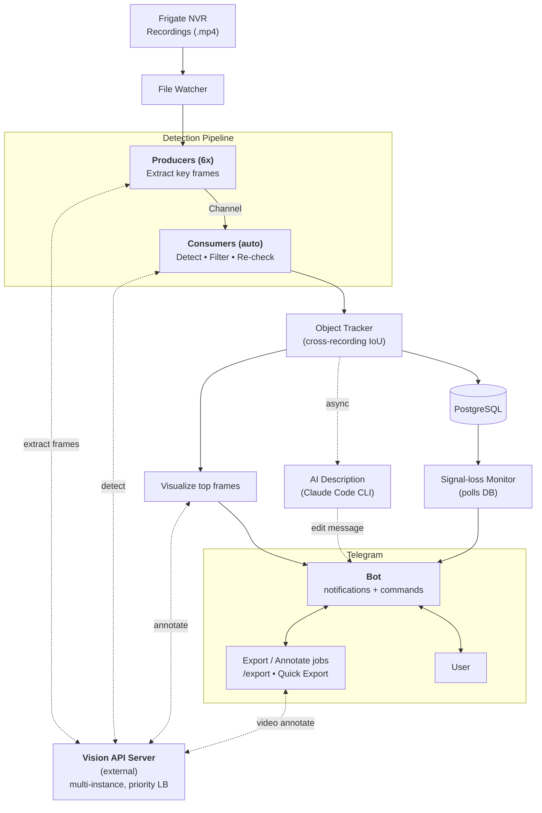

# Дизайн: обновление диаграммы «How It Works» в README

**Дата:** 2026-05-26
**Ветка:** `docs/refresh-howitworks-diagram`
**Скоуп:** обновление одной секции `README.md` — `## How It Works`. Без правок остального README, кода и `.claude/rules/`.

## Контекст

Текущая mermaid-диаграмма впервые появилась в коммите `9abb8d3` (2026-03-03) и с тех пор не менялась. За эти ~3 месяца проект получил крупные подсистемы, которые в схеме не отражены:

| Что добавлено в код, но отсутствует в текущей диаграмме |
|---|
| Multi-server load balancing для детекции (vision-api-server как внешний сервис с приоритетной балансировкой) |
| Two-stage detection — initial scan + recheck с более точной моделью (есть только короткое упоминание в подписи Consumers) |
| Object tracking — cross-recording IoU для подавления дубликатов |
| Signal-loss monitor — отдельная подсистема, polls БД, шлёт алерты |
| AI description — async через Claude Code CLI, редактирует уже отправленное сообщение |
| Двунаправленный Telegram: `/export` диалог, Quick Export inline-кнопки, обращение к ffmpeg / Vision API для аннотации |

Текущая схема даёт линейный поток `Recordings → Watcher → Producers→Consumers → DB → Visualize → Telegram`. Реальная система имеет минимум три независимых подсистемы (основной pipeline, signal-loss monitor, Telegram-интеракции) плюс внешний vision-api-server, к которому обращаются четыре разных стадии.

## Решения по дизайну

Принятые в ходе brainstorming:

1. **Одна расширенная диаграмма**, а не несколько мини-схем.
2. **Vision API Server — один внешний блок** с подписью «multi-instance, priority LB». Не рисуем LB отдельно и не показываем N инстансов — это перегрузило бы диаграмму.
3. **Двунаправленный Telegram**: показываем не только исходящие уведомления, но и команды от пользователя (`/export`, Quick Export) с обратным потоком через export jobs.
4. **Группировка через `subgraph`** для smyslovых блоков: Detection Pipeline, Telegram. Это даёт визуальную иерархию.

## Соответствие коду

| Узел диаграммы | Где живёт |
|---|---|
| File Watcher | `core/task/WatchRecordsTask`, `WatchRecordsLoop` |
| Producers (6x) | `core/pipeline/frame/FrameExtractorProducer` |
| Consumers (auto) | `core/pipeline/frame/FrameAnalyzerConsumer` |
| Vision API Server (external) | `vision-api-server` репо + балансировка в `loadbalancer/` |
| Object Tracker (IoU) | `service/ObjectTrackerService` → `NotificationDecisionService` |
| PostgreSQL | recordings, detections, object_tracks |
| Visualize top frames | визуализация фреймов через Vision API внутри `RecordingProcessingFacade` |
| AI Description | `ai-description/` + `telegram/queue/DescriptionEditJobRunner` |
| Signal-loss Monitor | `core/task/SignalLossMonitorTask`, `SignalLossDecider` |
| Telegram Bot | `telegram/` (bot core, очередь сообщений, авторизация) |
| Export / Annotate jobs | `telegram/handler/export/`, `telegram/handler/quickexport/` |

## Ключевые потоки на диаграмме

1. **Основной pipeline** (вертикальный поток):
   `Recordings → Watcher → Producers → Consumers → Object Tracker → DB / Visualize → Telegram → User`

2. **Vision API связан с четырьмя стадиями** (пунктирные двунаправленные стрелки):
   - Producers — extract frames
   - Consumers — detect (включая two-stage recheck)
   - Visualize top frames — annotate для уведомлений
   - Export jobs — video annotate для Quick Export «Annotated»

3. **Параллельная ветка signal-loss:** `DB → SignalLossMonitor → Bot` — это отдельное сообщение в Telegram, не edit существующего.

4. **Параллельная ветка AI description:** `Object Tracker → AI Description (Claude CLI) → Bot (edit message)` — async, редактирует уже отправленное уведомление.

5. **Обратная связь от пользователя** (двунаправленные стрелки):
   `User → Bot → Export Jobs` → ffmpeg merge или Vision API (video-annotate) → `Bot → User`.

## Mermaid-код

## Out of Scope

- Изменение текстового пояснения под диаграммой (фраза про vision-api-server остаётся как есть).
- Любые другие правки в README (Features, Configuration, Telegram Bot, и т.д.).
- Изменения в `.claude/rules/` и других docs.
- Изменения в коде.

## Критерии готовности

- `README.md` отрендеренный на GitHub корректно показывает обновлённую диаграмму.
- Все упомянутые в Features подсистемы (multi-server LB, two-stage detection, object tracking, signal-loss, AI description, Quick Export) присутствуют на диаграмме или явно подписаны.
- Mermaid синтаксис валиден (проверяется визуально в IDE / GitHub preview).
