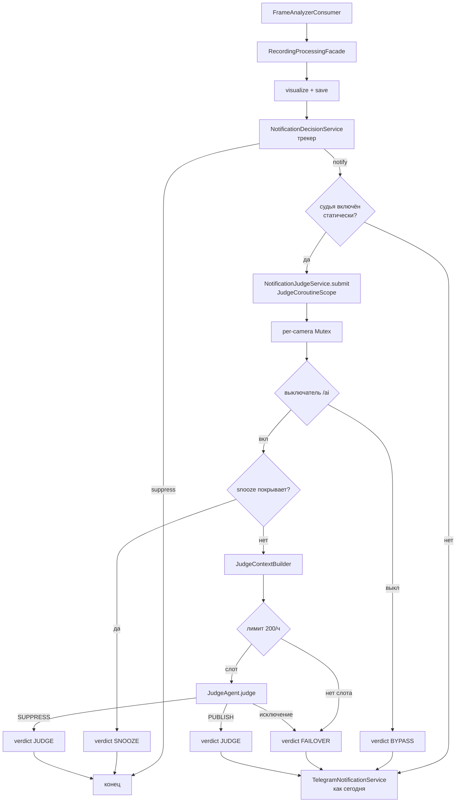

# LLM-судья уведомлений: дизайн

**Дата:** 2026-09-05
**Ветка:** `feature/llm-notification-judge`
**Статус:** на ревью владельца

## 1. Задача

Бот присылает ложные и повторные уведомления трёх видов:

1. **Статика.** Во дворе стоит машина и лежат велосипеды. Ночью в ИК-режиме детектор теряет
   их на 10–50 минут, иногда дольше часа, и каждая пауза даёт `REAPPEARED`. За ночь
   25 августа cam2 прислала три таких сообщения, хотя ничего не происходило.
2. **Не то в рамке.** На cam4 поленница детектируется как `motorcycle 0.63`, а днём раньше
   в том же месте трекер держал `person`. Рамка одинаковая в обоих кадрах.
3. **Ночь и погода.** На cam2 засвет от лампы у верхнего края кадра стал `bird 0.70`.

Четвёртый источник шума не ошибка, а дубли: 30 августа в 11 часов на cam2 человек попал
в 144 записи за час. Идущий человек не совпадает с собой по IoU, и почти каждая запись
становится `NEW_OBJECTS`.

Что показала база на `old.zinin.ru` (данные с 24 мая, 2,76 млн записей, 2,49 млн детекций):

| Камера | Объект в одной точке кадра | Записей за 30 дней | Дней |
|---|---|---|---|
| cam2 | car | 59 804 | 23 |
| cam2 | bicycle | 23 913 | 6 |
| cam3 | car | 20 298 | 13 |
| cam4 | person у поленницы | 332 за 7 дней | 7 |

Описания Claude уже распознают типы 2 и 3 («людей, животных или машин не видно», «вероятно,
ложное срабатывание»), но это суждение никак не используется. Тип 1 по кадру не виден,
он виден только по истории: та же машина в том же месте в 29 095 записях за неделю.

## 2. Цели и не-цели

**Цели**

- Третья ступень проверки перед отправкой: модель смотрит кадры и контекст из базы и решает,
  публиковать ли уведомление.
- Убрать три типа ложных срабатываний и дубли одной ситуации.
- Быстрая и дешёвая модель судьи, независимая от модели описаний.
- Каждый вердикт записан и виден владельцу.
- При любом сбое судьи поведение как сегодня (fail-open).

**Не-цели первой версии**

- Кнопка обратной связи «ложное» под уведомлением. Схема вердиктов оставляет под неё место.
- Агентный доступ модели к базе. Контекст собираем сами (раздел 5), причины в разделе 5.5.
- Изменение текста уведомления. Вердикт не показывается получателям.
- Инструмент офлайн-переоценки вердиктов. Данные для него сохраняются (`context_json`).
- Изменения трекера, расписания и очереди Telegram.

## 3. Решения, принятые с владельцем

| Вопрос | Решение |
|---|---|
| Задержка на время ответа модели | Держать все уведомления до вердикта |
| Длинное событие (человек час в огороде) | Одно сообщение, дальше только по существу |
| Видимость подавленного | Счётчики в `/status`, owner-команда `/verdicts` |
| Обратная связь получателей | Не в первой версии |
| Модель и лимиты | Отдельный пресет судьи; лимит описаний 30/ч (было 10), защитный лимит судьи 200/ч |
| Сбой судьи | Отправлять как сейчас |
| Контекст | Фиксированная выгрузка из базы плюс поле `wanted` в ответе |
| Хранение вердиктов | Вечно, без чистки |
| Зона времени в промпте | Зона владельца из `/timezone`; контейнер работает в UTC |

## 4. Архитектура

### 4.1. Место в потоке

Сегодня `RecordingProcessingFacade.processAndNotify`: визуализация кадров → чтение
глобального флага → сохранение результата → решение трекера → отправка с плейсхолдером →
правка описанием Opus.

С судьёй фасад после `decision.shouldNotify == true` не отправляет сам, а передаёт кандидата
`NotificationJudgeService` и сразу возвращается. Consumer pipeline не ждёт модель.



Пять шагов оркестратора на одного кандидата:

1. **Snooze.** Камера «усыплена» предыдущим вердиктом и кандидат не выходит за покрытие →
   `SUPPRESS`, причина `SNOOZED`, модель не вызывается.
2. **Контекст.** `JudgeContextBuilder` собирает JSON (раздел 5).
3. **Вызов судьи.** `JudgeAgent.judge(request)`: свой пресет, семафор, таймаут, лимит.
4. **Запись вердикта** в `notification_verdicts`. Всегда, включая сбои и snooze.
5. **Отправка** через существующий `TelegramNotificationService.sendRecordingNotification`
   при `PUBLISH`, с тем же `descriptionSupplier`, что фасад строит сегодня. Дальше плейсхолдер и
   правка описанием без изменений. При `SUPPRESS` ничего не уходит.

### 4.2. Компоненты по модулям

| Модуль | Компонент | Ответственность |
|---|---|---|
| core | `NotificationJudgeService` | оркестрация пяти шагов, per-camera очередь, fail-open, snooze в памяти, снимок snooze для `/status` |
| core | `JudgeCoroutineScope` | `Dispatchers.IO + SupervisorJob`, `@PreDestroy` с таймаутом 10 с, копия `DescriptionCoroutineScope` |
| core | `JudgeContextBuilder` | сборка контекста из репозиториев в JSON, поблочная деградация |
| core | `JudgeZoneResolver` | зона для локальных времён в промпте: env → зона владельца → зона JVM |
| core | `AppSettingsJudgeRuntimeSettings` | `JudgeRuntimeSettings` поверх `AppSettingsService` |
| core | `AiJudgeGuard` | падение на старте при `judge.enabled=true` и `description.enabled=false` |
| core | `JudgeCandidate` | DTO: запись, детекции, решение трекера, кадры, визуализированные кадры, `descriptionSupplier` |
| ai-description | `JudgeAgent`, `JudgeRequest`, `JudgeVerdict`, `JudgeRuntimeSettings`, `ActiveJudgePreset` (api) | публичный контракт судьи |
| ai-description | `VisionBackend`, `VisionBackendFactory`, `VisionRequest`, `VisionInstructions` (core) | задаче-нейтральный SPI провайдера (раздел 10) |
| ai-description | `VisionCallExecutor`, `DescriptionTask`, `JudgeTask`, `DescriptionResponseParser`, `JudgeResponseParser` | исполнение вызова и две задачи над ним |
| ai-description | `SlidingWindowRateLimiter`, `DescriptionRateLimiter`, `JudgeRateLimiter` | два независимых лимита |
| ai-description | `JudgeProperties`, `AiJudgeAutoConfiguration` | конфигурация и бины судьи |
| service | `NotificationVerdictService`, `NotificationVerdictRepository`, `JudgeStatsRepository` | запись и чтение вердиктов, static score, история, счётчики |
| model | `NotificationVerdictEntity`, `VerdictStage`, `Verdict`, `VerdictReason`, `JudgeSection` | сущность, перечисления, секция `/status` |
| telegram | секция судьи в `/ai`, блок в `StatusMessageFormatter`, `VerdictsCommandHandler` | владельческий UI |
| liquibase | `1.0.6.xml` | таблица `notification_verdicts` и индексы |

Границы: `ai-description` по-прежнему не знает про базу. `JudgeRequest` несёт кадры, язык и
уже собранный контекст строкой JSON. Всё, что ходит в репозитории, живёт в `core` и `service`.

### 4.3. Что не меняется

Трекер, `NotificationDecisionService`, очередь Telegram, поток описаний, текст уведомления.
При `application.ai.judge.enabled=false` бинов судьи нет, и фасад ведёт себя ровно как сегодня.

## 5. Контекст судьи

### 5.1. Блоки

`JudgeContextBuilder` собирает один JSON-объект. Он целиком попадает в промпт и в колонку
`context_json` строки вердикта.

| Блок | Источник | Содержимое |
|---|---|---|
| `recording` | `RecordingDto` | камера, локальное время записи и её зона, задержка обработки в секундах (`processTimestamp - recordTimestamp`) |
| `frames[]` | кадры записи | индекс кадра, размер в пикселях, детекции кадра (класс, confidence, bbox) |
| `objects[]` | детекции записи, кластеризованные `BboxClusteringHelper.cluster` с `innerIou` и `confidenceFloor` трекера | класс, confidence, bbox, число кадров, где объект виден, и `static` (5.2) |
| `tracker` | `NotificationDecision` | причина (`NEW_OBJECTS`, `REAPPEARED`, `TRACKER_ERROR`), новые классы, вернувшиеся классы, `maxAbsence` |
| `active_tracks[]` | `object_tracks` камеры, `last_seen_at` в пределах TTL от времени записи | класс, bbox, `first_seen`, `last_seen`, совпал ли с текущей записью (`last_recording_id`) |
| `recent_verdicts[]` | `notification_verdicts` камеры | до `history-limit` строк с `record_timestamp` в пределах `±history-window` от записи, новые первыми: время, `stage`, `verdict`, `reason`, `classes`, `summary` |
| `last_published` | то же | последний `PUBLISH` камеры по `record_timestamp`: время, классы, `summary` |
| `camera_notes` | `application.ai.judge.cameras.<cam>.notes` | заметка владельца о сцене; пусто по умолчанию |

Пример объекта в приложении A.

### 5.2. Static score

Для каждого объекта из `objects[]` один запрос: сколько записей камеры за `static-window`
(по умолчанию 7 дней) до времени записи содержали детекцию того же класса, чей IoU с bbox
объекта не меньше `static-iou` (по умолчанию 0.4). Собственная запись исключается.

```sql
SELECT count(DISTINCT d.recording_id)                      AS recordings,
       count(DISTINCT (d.detection_timestamp AT TIME ZONE :zone)::date) AS days,
       min(d.detection_timestamp)                           AS first_seen,
       max(d.detection_timestamp)                           AS last_seen
FROM detections d
JOIN recordings r ON r.id = d.recording_id
WHERE d.detection_timestamp >= :from AND d.detection_timestamp < :to
  AND r.cam_id = :camId
  AND d.class_name = :className
  AND d.recording_id <> :recordingId
  AND GREATEST(0, LEAST(d.x2, :x2) - GREATEST(d.x1, :x1))
    * GREATEST(0, LEAST(d.y2, :y2) - GREATEST(d.y1, :y1))
    >= :iou * (
        (d.x2 - d.x1) * (d.y2 - d.y1) + (:x2 - :x1) * (:y2 - :y1)
        - GREATEST(0, LEAST(d.x2, :x2) - GREATEST(d.x1, :x1))
        * GREATEST(0, LEAST(d.y2, :y2) - GREATEST(d.y1, :y1)));
```

Рядом отдаётся `recordings_in_window`: число записей камеры за то же окно, чтобы модель
видела масштаб (около 60 000 за неделю). Запрос с пересечением bbox на проде выполняется
за ~160 мс по индексу `idx_detections_detection_timestamp`; IoU добавляет арифметику в
фильтр, не меняя план. Новых индексов не требуется. Результат на примерах из раздела 1:
машина cam2 — 29 095 записей за 8 дней; `person` у поленницы cam4 — 332 записи за 7 дней;
`motorcycle` там же — 18.

### 5.3. Кадры

Судья получает кадры **с нарисованными рамками**, те же `VisualizedFrameData`, что уходят в
Telegram: он должен видеть, что именно обвёл YOLO. Берутся первые `max-frames` (по умолчанию 4)
из ранжирования `FrameVisualizationService.selectTopFrames`, в хронологическом порядке.
Уменьшение до `max-image-side` (по умолчанию 1280 px) делает существующий `FrameDownscaler`
внутри `VisionCallExecutor`. Координаты в контексте остаются в пикселях оригинала, размер
кадра указан в `frames[]`.

### 5.4. Зона времени

Контейнер на проде работает в UTC. Локальные времена в контексте форматируются в зоне,
которую даёт `JudgeZoneResolver`: `APP_AI_JUDGE_ZONE`, если задана; иначе зона владельца из
`TelegramUserService` (`/timezone`); иначе зона JVM. Зона указывается в блоке `recording`.

### 5.5. Почему не агентный доступ к базе

Оба провайдера запускаются как агентные CLI, и дать модели read-only `psql` можно без
переделки SDK-обвязки. Причины не делать этого в первой версии:

- **Задержка и цена.** Несколько ходов модели вместо одного превращают 15 секунд в минуту и
  умножают токены в 3–5 раз при том, что весь расчёт на быструю дешёвую модель.
- **Воспроизводимость.** С фиксированным контекстом промпт детерминирован и хранится рядом с
  вердиктом: те же кандидаты можно прогнать на другой модели и сравнить. Агентный прогон
  каждый раз другой.
- **Надёжность.** Быстрые модели хуже держат многошаговые сценарии: запрос без фильтра по
  времени на таблице в 2,5 млн строк, зацикливание. Нужны statement timeout, отдельная роль,
  allowlist запросов.

Дверь оставлена открытой: контекст собирают именованные провайдеры, которые можно выставить
как инструменты; контекст сохраняется целиком; в ответе есть поле `wanted` — чего модели не
хватило. Через несколько недель по `wanted` будет видно, нужен ли ещё один провайдер контекста,
ограниченный второй ход или агентность вообще.

## 6. Промпт и схема ответа

### 6.1. Инструкции

Один текст для обоих провайдеров (черновик в приложении B), кадры каждый провайдер
прикладывает своим способом: Claude ссылками `@path`, Grok inline-блоками. Политика:

- Роль: последняя ступень системы уведомлений домашних камер. Задача: решить, стоит ли
  беспокоить людей этой записью.
- `PUBLISH`, если вероятно новое реальное событие: человек, животное или транспорт, которые
  не являются известным статичным объектом и о которых недавно не сообщали.
- `SUPPRESS` с одной из причин:
  - `FALSE_POSITIVE` — в рамке не то, что говорит детектор: засвет, листва, поленница, тень;
  - `STATIC_OBJECT` — объект реальный, но стоит здесь давно: высокая доля записей за много
    дней в `static`, рамка не меняется между кадрами;
  - `DUPLICATE` — та же ситуация уже сообщена (`recent_verdicts`, `last_published`), ничего
    существенно нового.
- Асимметрия: **человека при сомнении публиковать.** Пропуск реального человека хуже лишнего
  сообщения. Для транспорта и предметов при сильной статистике статичности склоняться к
  подавлению. Ночью и в ИК скептичнее к странным формам и засветам, но люди публикуются.
- `snooze_minutes`: если ситуация будет и дальше порождать детекции, сколько минут можно не
  спрашивать по этой камере при тех же классах и не большем числе объектов.
- `summary` на языке `application.ai.description.common.language`.
- Ответ — только JSON-объект.

### 6.2. Схема ответа

```json
{
  "verdict": "PUBLISH | SUPPRESS",
  "reason": "NEW_EVENT | CHANGED_SITUATION | FALSE_POSITIVE | STATIC_OBJECT | DUPLICATE",
  "confidence": 0.0,
  "summary": "одно предложение: что в кадре и почему такой вердикт, до 200 символов",
  "snooze_minutes": 0,
  "wanted": "чего не хватило для уверенного решения, или пустая строка"
}
```

`JudgeResponseParser`:

- вырезает JSON из текста тем же `JsonBlockExtractor`;
- требует `verdict` и `reason`; `PUBLISH` допускает только `NEW_EVENT` и `CHANGED_SITUATION`,
  `SUPPRESS` — только три остальные; иное даёт `DescriptionException.InvalidResponse`;
- `confidence` вне `[0, 1]` или не число → `null`;
- `snooze_minutes` отсутствует или не число → 0; отрицательное → 0; больше `max-snooze` →
  `max-snooze`;
- `summary` и `wanted` обрезаются до 512 символов; отсутствие `summary` → пустая строка.

`confidence` и `wanted` только сохраняются, на решение не влияют. Для Grok та же схема
передаётся через `--json-schema`; для Claude формат описан текстом в epilogue.

## 7. Snooze

Snooze гасит дубли алгоритмически. Оркестратор держит в памяти по камере запись:

```
CameraSnooze(anchor: Instant, until: Instant, covered: Map<class, count>)
```

где `anchor` — `record_timestamp` оценённой записи, `until = anchor + snooze_minutes`,
`covered` — классы объектов записи с количеством. Запись создаётся при `snooze_minutes > 0` и
любом вердикте: после `PUBLISH` она означает «событие уже объявлено», после `SUPPRESS` — «ту
же статику или тот же дубль не спрашивать».

Кандидат покрыт snooze, если выполняются оба условия:

1. `|candidate.recordTimestamp - anchor| <= snooze_minutes`. По модулю, а не только вперёд:
   бэклог разбирается от новых к старым, и это тот же приём, что у cooldown `REAPPEARED`.
2. Каждый класс объектов кандидата есть в `covered`, и его количество не больше запомненного.

Новый класс или больше объектов того же класса будят судью. Snooze меняют только вердикты
`stage = JUDGE`: новый вердикт заменяет snooze камеры целиком (включая `covered`), вердикт с
`snooze_minutes = 0` снимает его. `FAILOVER` и `BYPASS` оставляют прежний snooze как есть: он
по-прежнему покрывает прежние классы.

Snooze живёт только в памяти процесса; после рестарта первый кандидат камеры идёт к модели.
`snooze_until` дублируется в строку вердикта для `/verdicts` и `/status`. Час работы в огороде
даёт так 3–4 вызова модели вместо 144.

## 8. Хранение: `notification_verdicts`

Миграция `1.0.6.xml`, включается в `master_frigate_analyzer.xml`. Одна строка на кандидата,
прошедшего трекер, независимо от исхода.

| Колонка | Тип | Смысл |
|---|---|---|
| `id` | UUID PK | |
| `created_at` | TIMESTAMPTZ NOT NULL | момент решения |
| `recording_id` | UUID NOT NULL, FK `recordings` ON DELETE CASCADE | |
| `cam_id` | VARCHAR(255) NOT NULL | |
| `record_timestamp` | TIMESTAMPTZ NOT NULL | денормализовано для выборок по камере |
| `stage` | VARCHAR(16) NOT NULL | `JUDGE`, `SNOOZE`, `FAILOVER`, `BYPASS` |
| `verdict` | VARCHAR(8) NOT NULL | `PUBLISH`, `SUPPRESS` |
| `reason` | VARCHAR(32) NOT NULL | см. ниже |
| `tracker_reason` | VARCHAR(32) NOT NULL | `NotificationDecisionReason` |
| `classes` | VARCHAR(255) NOT NULL | объекты записи: `person:1,car:1` |
| `confidence` | REAL NULL | |
| `summary` | VARCHAR(512) NULL | |
| `wanted` | VARCHAR(512) NULL | |
| `snooze_until` | TIMESTAMPTZ NULL | |
| `preset_id` | VARCHAR(32) NULL | пресет судьи; null для `SNOOZE`/`BYPASS` и для `FAILOVER` до резолюции пресета (`RATE_LIMITED`, `CONTEXT_ERROR`) |
| `model` | VARCHAR(255) NULL | `effectiveModel` пресета |
| `latency_ms` | INT NULL | длительность `judge()` |
| `context_json` | TEXT NULL | контекст промпта целиком; null для `SNOOZE`/`BYPASS` |
| `error` | VARCHAR(1024) NULL | детали сбоя для `FAILOVER` |

Значения `reason` по `stage`:

| `stage` | `verdict` | `reason` |
|---|---|---|
| `JUDGE` | `PUBLISH` | `NEW_EVENT`, `CHANGED_SITUATION` |
| `JUDGE` | `SUPPRESS` | `FALSE_POSITIVE`, `STATIC_OBJECT`, `DUPLICATE` |
| `SNOOZE` | `SUPPRESS` | `SNOOZED` |
| `FAILOVER` | `PUBLISH` | `TIMEOUT`, `RATE_LIMITED`, `UNAUTHORIZED`, `INVALID_RESPONSE`, `TRANSPORT`, `CONTEXT_ERROR` |
| `BYPASS` | `PUBLISH` | `JUDGE_OFF` |

Индексы: `idx_notification_verdicts_cam_record (cam_id, record_timestamp DESC)` для истории и
`/verdicts`, `idx_notification_verdicts_created (created_at)` для счётчиков `/status`.
Чистки нет: строки хранятся вечно по решению владельца. Оценка объёма: ~10 КБ на строку,
сотня строк в день в сезон — около 1 МБ в день.

Кнопка обратной связи в будущем добавит отдельную таблицу со ссылкой на `id` вердикта;
в этой таблице ничего резервировать не нужно.

## 9. Видимость

### 9.1. `/status`

`StatusResponse` получает поле `judge: JudgeSection`:

```kotlin
data class JudgeSection(
    val enabled: Boolean,          // статический флаг; false → остальные поля пустые
    val runtimeEnabled: Boolean,   // выключатель /ai
    val presetId: String?,
    val last24h: JudgeCounters,    // published, suppressedByReason: Map<String, Long>, failover, snoozed
    val snoozes: List<CameraSnoozeDto>, // camId, until, classes
)
```

Счётчики считаются по `created_at` за последние 24 часа одним запросом `GROUP BY stage,
verdict, reason`. Снимок snooze даёт `NotificationJudgeService.snapshotSnoozes()` по образцу
`SignalLossMonitorTask.snapshotStates()`. Секция отдаётся по REST и в Telegram;
`StatusMessageFormatter` рисует блок «⚖️ Judge» в том же моноширинном стиле. Ключи i18n
`status.section.judge`, `status.judge.*` в обоих бандлах.

### 9.2. `/verdicts`

Owner-команда (`ownerOnly = true`, как `/ai`): `/verdicts [cam] [n]`. Без аргументов — последние
10 вердиктов всех камер по `record_timestamp`; `cam` фильтрует по камере; `n` от 1 до 30.
Строка: время в зоне владельца, камера, значок вердикта (📨 `PUBLISH`, 🔇 `SUPPRESS`,
⚠️ `FAILOVER`), `stage`, `reason`, `classes`, `summary`. Сообщение обрезается по лимиту
Telegram 4096 символов с пометкой. Только текст, кадры не хранятся; запись доступна через
существующий `/export` по времени. Аргументы с ошибкой дают подсказку формата.

## 10. Модуль `ai-description`

### 10.1. Задаче-нейтральный SPI

Сегодня `DescriptionBackend.describe(DescriptionRequest): DescriptionResult` знает и промпт
описаний, и разбор `short`/`detailed`. Судья с таким контрактом не совместим, а дублировать
staging кадров, вызов и маппинг ошибок в каждом провайдере не хочется.

```kotlin
interface VisionBackend {
    val providerId: String
    val authScopeId: String
    val authRecoveryHint: String
    suspend fun complete(request: VisionRequest): String   // сырой текст модели
}

data class VisionRequest(
    val requestId: UUID,               // id записи, для имён временных файлов и логов
    val frames: List<FrameImage>,
    val instructions: VisionInstructions,
)

data class VisionInstructions(
    val systemPrompt: String,
    val preamble: String,              // текст до кадров
    val epilogue: String,              // правила и формат ответа после кадров
    val jsonSchema: String?,           // для провайдеров со structured output
)
```

- **Claude:** staging кадров как сейчас; промпт = `preamble`, блок `- Frame N: @path`,
  `epilogue`; `systemPrompt` уходит в опцию системного промпта SDK, а если
  `ClaudeAsyncClientFactory` её не выставляет, становится первым абзацем промпта; ответ —
  сырой текст. `ClaudePromptBuilder` сводится к сборке этих частей.
- **Grok:** блоки prompt.json = текст `preamble`, пары «подпись кадра + картинка», текст
  `epilogue`; `--json-schema` берётся из `instructions.jsonSchema` вместо зашитой схемы
  `short`/`detailed`; откат при «схема не поддерживается» остаётся; ответ — JSON structured
  output или текст.
- Маппинг ошибок в `DescriptionException` не меняется.

### 10.2. Задачи и исполнитель

- `DescriptionTask` строит `VisionInstructions` для описаний (тексты нынешних
  `ClaudePromptBuilder`/`GrokPromptBuilder`, схема `short`/`detailed`) и разбирает ответ
  провайдер-нейтральным `DescriptionResponseParser` (наследник нынешнего
  `ClaudeResponseParser`; Grok сходится в него же, а не читает поля сам).
- `JudgeTask` строит инструкции судьи (раздел 6) и разбирает ответ `JudgeResponseParser`.
- `VisionCallExecutor` — нынешний `DefaultDescriptionAgent` без привязки к задаче: резолюция
  пресета до семафора, семафор, `queueTimeout`, `timeout`, retry по `InvalidResponse` и
  `Transport` с проверкой остатка бюджета, downscale кадров, отчёт в `ProviderAuthTracker`.
  Параметризуется `VisionLimits(queueTimeout, timeout, maxConcurrent, maxImageSide)` и
  резолвером. Два экземпляра: описания с `DescriptionProperties.common`, судья с
  `JudgeProperties`.
- `DefaultDescriptionAgent` и `DefaultJudgeAgent` — тонкие обёртки: построить инструкции,
  вызвать executor, разобрать.

### 10.3. Каталог и резолверы

Каталог пресетов один на обе задачи: backend теперь не привязан к задаче, поэтому один
`VisionBackend` на пресет обслуживает и описания, и судью. Резолверов два:
`ActivePresetResolver(catalog, DescriptionRuntimeSettings, fallbackId)` и
`ActivePresetResolver(catalog, JudgeRuntimeSettings, fallbackId)`. Fallback переезжает из
каталога в резолвер; оба default-пресета проверяются на старте на существование и пригодность.
Пустой `judge.default-preset` означает тот же fallback, что у описаний.

`JudgeRuntimeSettings` повторяет `DescriptionRuntimeSettings`: `sourceName`,
`activePresetId`/`setActivePresetId`, `judgeEnabled`/`setJudgeEnabled`. `ActiveJudgePreset`
повторяет `ActiveDescriptionPreset` для экрана `/ai`. In-memory дефолт регистрируется через
`@ConditionalOnMissingBean`, реализация над `app_settings` живёт в `core`.

### 10.4. Лимиты

`DescriptionRateLimiter` обобщается в `SlidingWindowRateLimiter(name, rateLimit, clock)`; два
типизированных наследника `DescriptionRateLimiter` и `JudgeRateLimiter`, чтобы инъекция шла по
типу без квалификаторов. Лимит описаний по умолчанию **30/ч** (было 10). Лимит судьи 200/ч
проверяется в `NotificationJudgeService` до вызова агента; нет слота → `FAILOVER`,
`RATE_LIMITED`. Как и сейчас, слот не возвращается при сбое вызова.

### 10.5. Переименования

Только то, что меняет смысл: `DescriptionBackend` → `VisionBackend`,
`DescriptionBackendFactory` → `VisionBackendFactory`, `DefaultDescriptionAgent` →
`VisionCallExecutor` плюс тонкий `DefaultDescriptionAgent`. `DescriptionPreset*`,
`DescriptionPresetCatalog`, ключ yaml `application.ai.description.presets`, команда `/ai` и
имя модуля остаются: это общий каталог AI-пресетов, что и записывается в документацию.

### 10.6. Условия включения

Бины судьи (`AiJudgeAutoConfiguration`) поднимаются при `application.ai.description.enabled=true`,
объявленных пресетах (`DescriptionPresetsDeclaredCondition`) и
`application.ai.judge.enabled=true`. `AiJudgeGuard` в `core` роняет старт при
`judge.enabled=true` и `description.enabled=false` с сообщением, что судье нужен каталог
пресетов. Telegram при этом уже гарантирован `AiDescriptionTelegramGuard`. Sanity-checker по
образцу `DescriptionAgentSanityChecker` предупреждает, если `judge.enabled=true`, а агента нет.

## 11. `/ai`

Экран получает второй блок под блоком описаний: состояние судьи (вкл/выкл), активный пресет
судьи в том же формате `id (provider / effectiveModel / effort)`, строка рассогласования при
недоступном сохранённом пресете, и свой ряд кнопок по каталогу. Кнопки судьи помечены ⚖️,
кнопки описаний получают 📝, чтобы два ряда различались. Блок отсутствует, если
`application.ai.judge.enabled=false`.

Callback-и остаются в префиксе `aip:` с явными глаголами: `aip:j:on`, `aip:j:off`,
`aip:j:set:<id>`. Никаких toggle. `AiSettingsCallbackHandler.classify` расширяется новыми
исходами без изменения порядка «ответить → записать → перерисовать».

`AiSettingsViewState` получает `judgeAvailable`, `judgeEnabled`, `judgeStoredPresetId`,
`judgeEffectivePresetId`. `AiSettingsViewStateFactory` читает их через `ObjectProvider`
fail-open, как сейчас.

Ключи `app_settings`: `ai.judge.preset.active` (строка), `ai.judge.enabled` (boolean,
отсутствует = включён). Добавляются в `AppSettingKeys`. Кэш настроек per-process, как для
остальных ключей.

Авторизация общая: судья ходит через тот же `ProviderAuthTracker`, alert владельцу о потере
токена один на оба потребителя. Строки областей учётных данных на экране не дублируются.

## 12. Ошибки и конкурентность

- **Сбои модели** маппятся в причины `FAILOVER` один к одному: `Timeout`, `RateLimited`,
  `Unauthorized`, `InvalidResponse` (после одного повтора внутри executor-а), `Transport`.
  Сообщение уходит, `error` хранит детали без секретов.
- **Сбой сборки контекста** мягкий и поблочный: упавший провайдер оставляет в JSON вместо
  блока `{"error": "<класс исключения>"}`, судья решает по остальному. Только исключение
  всего билдера даёт `FAILOVER` с `CONTEXT_ERROR`.
- **Сбой записи вердикта** логируется как ERROR, решение исполняется. Snooze в памяти
  выставляется независимо от записи.
- **Сбой отправки** — как сегодня: логируется, вердикт уже записан как `PUBLISH`.
- **Выключатель `/ai`** читается на входе каждого кандидата с таймаутом 5 с и fail-open к
  «включён» — как `descriptionsEnabled` в фасаде. Выключен → `BYPASS`.
- **Очерёдность.** Snooze проверяется под per-camera `Mutex`, кандидат всегда видит вердикт
  предыдущего по своей камере. Таймаута на мьютексе нет: очередь одной камеры разгребается
  быстро, потому что после первого вердикта серию закрывает snooze без вызова модели.
  Семафор executor-а общий для всех камер; ожидание слота дольше `queue-timeout` даёт
  `Timeout` и fail-open. Очередь длиннее 20 кандидатов на камеру пишет WARN.
- **Память.** Кандидат держит визуализированные кадры (до 1 МБ каждый) на время ожидания в
  очереди камеры. Двадцать кандидатов — до 40 МБ. Приемлемо для одного экземпляра.
- **Бэклог от новых к старым.** Snooze считается по модулю разницы времени, история в
  контексте берётся в `±history-window` и включает более поздние вердикты с явными временами.
- **Остановка приложения.** `JudgeCoroutineScope` гасится с таймаутом 10 с. Кандидат,
  застигнутый рестартом между сохранением записи и вердиктом, теряется. Это тот же класс
  потери, что сегодня у отправки после сохранения.
- **Единственный экземпляр.** Snooze и кэш настроек живут в процессе, как и остальные
  механизмы приложения. Развёртывание с двумя экземплярами не поддерживается, как и сейчас.

## 13. Конфигурация

Секция `application.ai.judge.*` в `application.yaml`:

| Переменная | По умолчанию | Смысл |
|---|---|---|
| `APP_AI_JUDGE_ENABLED` | `false` | статический флаг фичи |
| `APP_AI_JUDGE_DEFAULT_PRESET` | пусто = fallback описаний | пресет судьи до первого выбора в `/ai`; для прода рекомендуется `claude-sonnet` или `grok-fast` |
| `APP_AI_JUDGE_TIMEOUT` | `60s` | вызов судьи с повторами |
| `APP_AI_JUDGE_QUEUE_TIMEOUT` | `30s` | ожидание слота семафора |
| `APP_AI_JUDGE_MAX_CONCURRENT` | `2` | одновременные вызовы судьи |
| `APP_AI_JUDGE_MAX_FRAMES` | `4` | кадров судье, `1..10` |
| `APP_AI_JUDGE_MAX_IMAGE_SIDE` | `1280` | длинная сторона кадра; `0` = как есть |
| `APP_AI_JUDGE_RATE_LIMIT_ENABLED` | `true` | |
| `APP_AI_JUDGE_RATE_LIMIT_MAX` | `200` | вызовов в окно |
| `APP_AI_JUDGE_RATE_LIMIT_WINDOW` | `1h` | |
| `APP_AI_JUDGE_MAX_SNOOZE` | `PT30M` | потолок `snooze_minutes` |
| `APP_AI_JUDGE_STATIC_WINDOW` | `P7D` | окно static score |
| `APP_AI_JUDGE_STATIC_IOU` | `0.4` | порог IoU static score, `0..1` |
| `APP_AI_JUDGE_HISTORY_WINDOW` | `PT6H` | `±` окно истории вердиктов |
| `APP_AI_JUDGE_HISTORY_LIMIT` | `10` | строк истории в контексте, `1..50` |
| `APP_AI_JUDGE_ZONE` | пусто = зона владельца, затем JVM | локальное время в промпте |
| `application.ai.judge.cameras.<cam>.notes` | пусто | заметки владельца о сцене, только yaml |
| `APP_AI_DESCRIPTION_RATE_LIMIT_MAX` | **`30`** (было 10) | лимит описаний |

Валидация в `JudgeProperties` по образцу `DescriptionProperties`: положительные длительности,
диапазоны, `default-preset` объявлен, если карта пресетов не пуста.

## 14. Тестирование

**Модульные тесты** (MockK, kotlin-test, `runTest`):

| Область | Что проверяется |
|---|---|
| `JudgeResponseParser` | все допустимые пары `verdict`/`reason`, запрет недопустимых, обрезка `snooze_minutes`, `summary`, `wanted`, `confidence` вне диапазона, мусор вместо JSON |
| `JudgeTask` | промпт содержит контекст, язык `summary`, политику; инструкции детерминированы |
| Claude backend | порядок preamble → кадры → epilogue, `systemPrompt` в опциях, маппинг ошибок без изменений |
| Grok backend | блоки в правильном порядке, `jsonSchema` из запроса, откат при неподдерживаемой схеме |
| `VisionCallExecutor` | нынешний `DefaultDescriptionAgentTest` переезжает; два экземпляра с независимыми семафорами и таймаутами |
| `SlidingWindowRateLimiter` | два экземпляра с разными окнами, имена в логах |
| Snooze | покрытие, побуждение новым классом, побуждение ростом количества, окно по модулю, потолок, замена и снятие |
| `NotificationJudgeService` | fail-open на каждый тип исключения с правильной причиной, `BYPASS`, `SNOOZE` без вызова агента, лимит → `RATE_LIMITED`, порядок внутри камеры, параллельность между камерами, устойчивость к ошибке записи вердикта |
| `JudgeContextBuilder` | форма JSON, поблочная деградация, исключение собственной записи из static score |
| `JudgeZoneResolver` | приоритет env → владелец → JVM |
| `RecordingProcessingFacade` | при судье передаёт кандидата и не отправляет сам; без судьи существующие тесты проходят без изменений |
| Telegram | `classify` для `aip:j:*`, рендер секции судьи и её отсутствие при выключенной фиче, блок в `StatusMessageFormatter`, разбор аргументов `/verdicts`, метаданные команды, ключи i18n в обоих бандлах |

**Интеграционные** (Testcontainers Postgres, `IntegrationTestBase`): миграция `1.0.6.xml`
применяется; SQL static score на посеянных детекциях считает IoU, окно и исключение собственной
записи правильно; запрос истории в `±` окне; счётчики за 24 часа; `JudgeRuntimeSettings`
поднимается над `app_settings`, а не in-memory.

**Приёмка на проде:** включить судью на быстром пресете и прогнать день по `/verdicts`. Шесть
примеров из раздела 1 должны дать `SUPPRESS` с ожидаемыми причинами: засвет —
`FALSE_POSITIVE`; поленница — `FALSE_POSITIVE` или `STATIC_OBJECT`; машина и велосипеды —
`STATIC_OBJECT`. Реальный человек во дворе — `PUBLISH` один раз, дальше `SNOOZED` и
`DUPLICATE`.

## 15. Развёртывание

1. **Заплатка до выката, независимо от фичи:** `NOTIFICATIONS_TRACK_REAPPEAR_CLASSES=person`
   в `.env` на проде и рестарт. Убирает возвраты машины и велосипедов, первое появление машины
   продолжает приходить.
2. Миграция `1.0.6.xml` применяется контейнером liquibase при деплое.
3. `.env`: `APP_AI_JUDGE_ENABLED=true`, `APP_AI_JUDGE_DEFAULT_PRESET=claude-sonnet` (или
   `grok-fast`), при необходимости `APP_AI_JUDGE_TIMEOUT`.
4. `application-docker.yaml`: при желании `application.ai.judge.cameras.<cam>.notes` для
   четырёх камер.
5. Первые дни смотреть `/verdicts` и `/status`; при систематических ошибках менять пресет в
   `/ai` или править политику промпта.

## 16. Документация

- `.claude/rules/ai-description.md`: SPI `VisionBackend`, две задачи, executor, судья, `/ai`
  с двумя блоками; `paths:` расширить на `**/judge/**`, `**/Verdicts*`.
- `.claude/rules/configuration.md`: секция «AI Judge», новый дефолт лимита описаний.
- `.claude/rules/database.md`: таблица `notification_verdicts`, ключи `ai.judge.*`.
- `.claude/rules/pipeline.md`: фасад передаёт кандидата судье.
- `.claude/rules/telegram.md`: команда `/verdicts`, блок в `/status`.
- `CLAUDE.md`: назначение модуля `ai-description` и паттерн «LLM-судья».
- `docker/deploy/application-docker.yaml.example`: пример `cameras.<cam>.notes`.

## 17. Возможные продолжения

Не входят в первую версию, записаны, чтобы схема их не исключала:

- Кнопка «👎 ложное» под уведомлением; таблица обратной связи со ссылкой на вердикт;
  размеченные примеры камеры в контексте.
- Разбор поля `wanted`; при частом запросе кадров прошлого события — ограниченный второй ход
  с одним дополнительным блоком контекста.
- Пометка в уведомлении о `FAILOVER`, чтобы получатель понимал, почему пришёл спам.
- Офлайн-переоценка вердиктов по `context_json` и кадрам из видео.

## Приложение A. Пример контекста

```json
{
  "recording": {
    "cam": "cam4",
    "time": "2026-09-04T10:22:48+03:00",
    "zone": "Europe/Moscow",
    "processing_lag_seconds": 51
  },
  "frames": [
    {"index": 0, "width": 2560, "height": 1920,
     "detections": [{"class": "motorcycle", "confidence": 0.628, "bbox": [151, 1387, 441, 1651]}]},
    {"index": 1, "width": 2560, "height": 1920,
     "detections": [{"class": "motorcycle", "confidence": 0.629, "bbox": [151, 1387, 441, 1651]}]}
  ],
  "objects": [
    {
      "class": "motorcycle", "confidence": 0.629, "bbox": [151, 1387, 441, 1651], "frames_seen": 2,
      "static": {"recordings": 18, "days": 7, "first_seen": "2026-08-28T12:04:10+03:00",
                 "last_seen": "2026-09-03T16:54:36+03:00", "recordings_in_window": 60412}
    }
  ],
  "tracker": {"reason": "NEW_OBJECTS", "new_classes": ["motorcycle"], "reappeared_classes": [], "max_absence": null},
  "active_tracks": [
    {"class": "person", "bbox": [204, 1408, 460, 1652], "first_seen": "2026-09-03T16:54:36+03:00",
     "last_seen": "2026-09-03T16:54:36+03:00", "matched_now": false}
  ],
  "recent_verdicts": [],
  "last_published": {"time": "2026-09-03T16:54:36+03:00", "classes": "person:1",
                     "summary": "Человек у поленницы в левом нижнем углу."},
  "camera_notes": "Огород за домом: грядки под сеткой, куча земли, поленница слева внизу."
}
```

## Приложение B. Черновик инструкций судьи

`systemPrompt`:

> You are the final gate of a home security camera notification system. Answer only with
> the requested JSON object. Do not call tools and do not ask questions.

`preamble`:

> A YOLO detector flagged objects in a short recording from camera `{cam}`. Your job is to
> decide whether the household should be notified about this recording. The frames below have
> the detector's boxes drawn on them. Context assembled from the database follows the frames.

`epilogue` (после кадров и JSON-контекста):

> Decide:
> - PUBLISH with reason NEW_EVENT when a real, new event is likely: a person, animal or vehicle
>   that is not a known static object and has not been reported recently. Use
>   CHANGED_SITUATION when an ongoing, already reported situation changed materially (another
>   person, a vehicle arrived, someone approached the house).
> - SUPPRESS with FALSE_POSITIVE when the boxed region is not what the detector claims (glare,
>   foliage, a woodpile, a shadow); with STATIC_OBJECT when the object is real but has been in
>   this spot for a long time (high share of recordings across many days in `static`, identical
>   box across frames); with DUPLICATE when the same situation was already reported
>   (`recent_verdicts`, `last_published`) and nothing new happened.
> - When in doubt about a person, PUBLISH: missing a real person is worse than one extra
>   message. For vehicles and objects with strong static evidence, lean to SUPPRESS. At night
>   and in infrared be sceptical of odd shapes and glare, but still publish people.
> - `snooze_minutes` (0–{maxSnooze}): if this situation will keep producing detections, how
>   long we may skip asking you about this camera while the object classes stay the same and
>   their count does not grow.
> - `summary`: one sentence in {language}, at most 200 characters: what is in the frames and
>   why this verdict.
> - `wanted`: what extra context would have made you confident, or an empty string.
>
> Return ONLY this JSON object:
> `{"verdict": "PUBLISH|SUPPRESS", "reason": "...", "confidence": 0.0, "summary": "...", "snooze_minutes": 0, "wanted": ""}`
