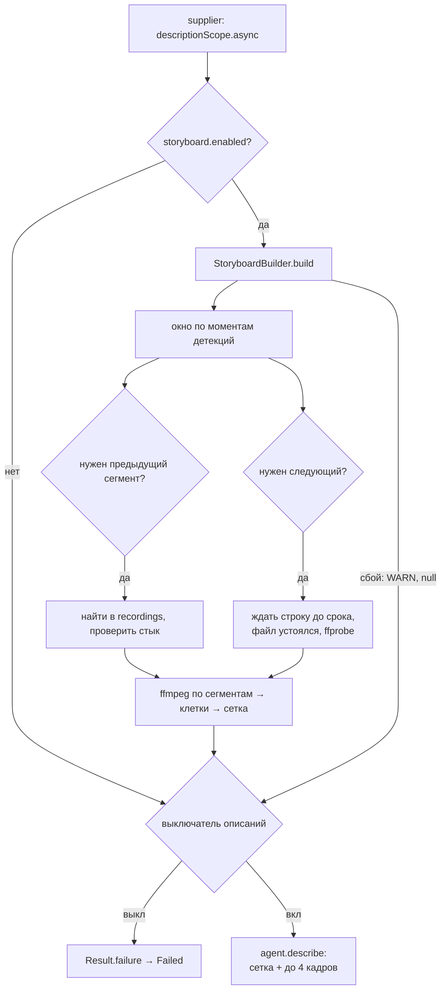

# Раскадровка для AI-описаний: дизайн

**Дата:** 2026-09-23
**Ветка:** `feat/description-storyboard`
**Статус:** на ревью владельца

## 1. Задача

AI-описание строится по нескольким кадрам одного сегмента Frigate, и модель не видит динамики.
Типичный случай: машину задетектировало только на одном кадре, и из описания непонятно, стоит
она или проехала. Такое бывает часто.

Почему так получается (по коду на `447b738`):

- vision-api 3.0 отдаёт из сегмента длиной 10–16 с до 6 кадров (`DETECT_MAX_FRAMES`, в среднем
  4.7): кадр 0, сетку раз в 4 с (`DETECT_MAX_GAP`) и пики движения.
- `RecordingProcessingFacade.buildDescriptionSupplier` отдаёт модели только кадры с детекциями
  (`FrameVisualizationService.selectTopFrames`), обычно 1–4 кадра с шагом в секунды. Машина
  пересекает кадр за 2–3 с и попадает в один из них. Пустые кадры до и после, по которым видно,
  что она проехала, в описание не попадают. Стоящая машина была бы на всех кадрах.
- `FrameExtractorProducer` перенумеровывает кадры и выбрасывает `timestamp` из ответа vision-api.
  Модель не знает, сколько времени прошло между кадрами. Сейчас камера пишет время на кадре, но
  не каждая камера это делает.
- Трекер гасит следующие сегменты того же события (`ALL_REPEATED`, TTL по умолчанию 30 минут),
  поэтому описание строится по первому сегменту, где появился объект, то есть часто по самому
  началу события.

Отдельно: короткое описание (`short`) выходит слишком коротким, его нужно удлинить примерно вдвое.

## 2. Цели и не-цели

**Цели**

- Модель видит развитие события во времени: откуда появился объект, куда двигался, остановился
  ли, уехал ли. Стоящий объект отличим от проехавшего.
- Окно вокруг детекции захватывает соседние сегменты, когда событие выходит за границу записи.
- У каждой картинки есть время, независимо от того, пишет ли его камера.
- Короткое описание примерно вдвое длиннее.
- Любой сбой раскадровки даёт описание как сегодня (fail-open), уже с подписями времени.

**Не-цели**

- Видео на вход модели. Claude и Grok его не принимают, а Gemini — это третий провайдер
  (раздел 3.1).
- Судья. Его кадры и промпт не меняются: он стоит на пути уведомления, и лишние кадры
  задержали бы само сообщение.
- Коллаж в Telegram. Получатели раскадровку не видят.
- Повторное описание после окончания события (второе редактирование сообщения).
- Модель, которая сама выбирает кадры.
- Абсолютное время и часовой пояс в промпте. Время только относительное.

## 3. Решения, принятые с владельцем

| Вопрос | Решение |
|---|---|
| Что именно ломается | Непонятно действие: модель не видит динамики, особенно когда детекция на одном кадре |
| Подход | Плотная раскадровка плюс соседние сегменты у границы записи |
| Видео в модель | Нет (раздел 3.1) |
| Задержка описания | Следующий сегмент ждём до 30 с; уведомление с кадрами уходит сразу, как сейчас |
| Время кадров | Всегда, относительное; на надпись камеры не полагаемся |
| Кадры в полном разрешении | Все кадры с детекциями из коллажа, но не больше 4 (`APP_AI_DESCRIPTION_MAX_FRAMES`: 10 → 4) |
| Короткое описание | Вдвое длиннее: `APP_AI_DESCRIPTION_SHORT_MAX` 200 → 400 и описание содержания `short` в промпте |
| Настройки раскадровки | Отдельный блок `application.ai.description.storyboard.*`, читает `core` |

### 3.1. Отвергнутые варианты

- **Только уже извлечённые кадры** (все до 6 кадров от vision-api, включая кадры без детекций).
  Кадры идут раз в 4 с. Что машина проехала, модель поймёт, а направление и манёвр — не всегда.
- **Видео через Gemini.** Claude (API и `Read` в Claude Code) и Grok (API и CLI) видео на вход
  не принимают. Gemini принимает, и Gemini CLI, судя по исходникам, берёт `.mp4` через `@path`.
  Но это третий провайдер: новый CLI в образе, своя авторизация, своя фабрика. К тому же Gemini
  сам режет видео по кадру в секунду, примерно по 70 токенов на кадр. Получается та же
  раскадровка, только грубее по разрешению.
- **Отдельные кадры вместо сетки.** Claude видит кадр только через вызов `Read`. При 16 файлах он
  вправе прочитать 3 из них, а `DefaultClaudeInvoker` отвечает на это лишь WARN. Кроме того, при
  больше чем 20 картинках в запросе у Claude действует лимит 2000 px на сторону. Сетка читается
  одним `Read`, и из неё не может выпасть кусок времени. Токенов сетка не экономит: Claude считает
  по пикселям.
- **Модель сама выбирает кадры** из папки с плотной нарезкой. Время и цена непредсказуемы, и для
  Grok это не подходит: инструменты у него отключены.
- **Два этапа** (сразу описание по текущему сегменту, потом уточнение со следующим). Два вызова
  модели и два редактирования на запись, лимит 30 в час расходуется вдвое быстрее.

## 4. Что получает модель

### 4.1. Картинки

Порядок: сначала раскадровка, потом кадры в полном разрешении по времени.

1. **Раскадровка.** JPEG шириной 2560 px, качество 0.85.
   - Клеток `n` не больше `tiles` (по умолчанию 16). Сетка: `columns = ceil(sqrt(n))`,
     `rows = ceil(n / columns)`. Для 16 клеток это 4×4, клетка 640 px, высота клетки по
     пропорциям камеры: для 16:9 — 360 px, вся сетка 2560×1440.
   - Клетки читаются слева направо и сверху вниз.
   - В левом верхнем углу клетки подпись на полупрозрачной тёмной подложке: время от начала
     показанного отрезка, например `5.0s`. Клетка, ближайшая к моменту детекции, подписана
     `5.0s • detection` и выделена цветом.
2. **Кадры в полном разрешении.** Те же кадры с детекциями, что первыми стоят в коллаже
   (`selectTopFrames`: по confidence, затем по числу детекций), не больше
   `APP_AI_DESCRIPTION_MAX_FRAMES` (по умолчанию 4), в хронологическом порядке. Исходные, без
   рамок, как сейчас. Раскадровка даёт динамику, эти кадры — детали: одежду, что в руках, номер.

### 4.2. Время

Ноль — начало показанного отрезка. С раскадровкой это начало участка записи, попавшего в окно,
без неё — начало записи. Все подписи, моменты детекций и границы записи в тексте отсчитываются
от этого нуля. Абсолютного времени нет: для динамики его хватает, часовой пояс не нужен, а время
записи и так есть в уведомлении.

### 4.3. Текст

Тексты по-прежнему живут только в `DescriptionTask`. Промпт остаётся на английском, описания
пишутся на языке `APP_AI_DESCRIPTION_LANGUAGE`.

С раскадровкой в `preamble` добавляется:

- что показывает раскадровка: `n` кадров с шагом `s` с за отрезок длиной `d` с, порядок чтения,
  подписи в секундах от начала отрезка;
- моменты детекций: для каждого кадра с детекциями его время и классы с максимальным confidence
  по классу, например `car 0.87 at 5.0s; person 0.71 at 9.0s`;
- чего нет: `Earlier footage is not available` или `Footage after 12.3s is not available`, если
  окно хотело захватить соседний сегмент, а его не оказалось. Без этой строки модель могла бы
  выдумать, что машина «уехала», когда запись просто кончилась;
- что кадры после раскадровки — полноразмерные, для деталей;
- просьба описать, как сцена развивается во времени: откуда появляются объекты, куда движутся,
  останавливаются ли, уезжают ли. Объект, который на всех клетках стоит на одном месте,
  неподвижен.

Подписи картинок задаёт задача, например `Storyboard: 16 frames, 1.0s apart, left to right, top
to bottom` и `Full-resolution frame at 5.0s`. Заголовок перед картинками тоже её: `Images:`.

Без раскадровки (выключена или сбой) текст прежний, а подписи кадров — `Frame at 5.0s` (секунды от
начала записи). Если времени нет, остаётся `Frame N`.

В `epilogue` для `short` вместо одного ограничения длины: 1–3 предложения о том, что произошло,
включая движение (кто или что, откуда, куда, остановился ли), не длиннее `shortMaxLength`. Это
действует и без раскадровки: удлинить `short` просил владелец, а модель считает одно ограничение
длины потолком и пишет коротко.

### 4.4. Цена

Для Claude 4.7 и новее картинка уменьшается до 2576 px по длинной стороне и стоит
`⌈w/28⌉ × ⌈h/28⌉` токенов. Сетка 2560×1440 — 4 784 токена, кадр 2880×1620 — столько же. Одна
сетка и до 4 кадров — не больше 24 тыс. токенов и 5 вызовов `Read`. Сейчас в худшем случае уходит
6 кадров, около 29 тыс. токенов. Цена картинки у Grok не документирована.

При `APP_AI_DESCRIPTION_MAX_IMAGE_SIDE=1568` `FrameDownscaler` сжимает сетку до 1568 px, и клетки
становятся около 390 px. Деталей меньше, но движение видно, а детали остаются на полноразмерных
кадрах.

## 5. Откуда берутся кадры

### 5.1. Место в потоке

Всё выполняется внутри supplier-а описания, то есть только когда описание действительно будет
сделано: Telegram-слой вызывает supplier после фильтра получателей и лимитера, а при включённом
судье — после `PUBLISH`.



Порядок внутри `descriptionScope.async`: раскадровка, затем выключатель описаний, затем
`agent.describe`. Выключатель остаётся вплотную к вызову модели. Если его выключили, пока
раскадровка ждала сегмент, модель не вызывается. Раскадровка строится до семафора
`VisionCallExecutor`, так что не занимает слоты модели, а таймауты модели (`queue-timeout`,
`timeout`) на неё не тратятся.

Supplier замыкает `RecordingDto` записи и её кадры (`FrameData` с байтами, детекциями и временем),
как сейчас замыкает отобранные кадры.

### 5.2. Время кадров

- `FrameData` получает `offsetSeconds: Double? = null` — presentation time кадра в секундах от
  начала записи, из `ExtractedFrameData.timestamp`.
- `FrameExtractorProducer` передаёт его при создании `FrameData`. `RecordingState` копирует кадр
  через `copy(detectResponse = …)`, так что поле доходит до фасада без других правок.
- vision-api 2.x присылал в `timestamp` номер кадра минус один. Клиент рассчитан на 3.0, оба
  проекта выкатываются вместе, отдельной защиты от 2.x нет.

### 5.3. Окно и клетки

`StoryboardPlanner` — чистый код без I/O. Время в нём — «время записи»: текущий сегмент занимает
`[0, D)`, где `D` — его длительность по ffprobe, предыдущий — `[-Dp, 0)`, следующий — `[D, D + Dn)`.

1. **Окно:** `[min(t) − before, max(t) + after]`, где `t` — моменты кадров с детекциями.
2. **Соседи.** Начало окна меньше 0 — нужен хвост предыдущего сегмента. Конец окна больше `D` —
   нужна голова следующего. Берём не больше одного соседа с каждой стороны: `before` и `after`
   не больше 10 с, а сегменты Frigate длятся около 10 с. Если соседа не хватает, окно
   обрезается по нему.
3. **Стык.** Соседа используем, только если он стыкуется с текущим:
   `|prev.recordTimestamp + Dp − cur.recordTimestamp| ≤ 1.5 с` и
   `|cur.recordTimestamp + D − next.recordTimestamp| ≤ 1.5 с`. Допуск нужен потому, что время
   начала в имени файла Frigate округлено до секунды. Сосед, который стыкуется, кладётся на
   шкалу по длительностям, а не по именам файлов, так что ложных разрывов и нахлёстов не бывает.
   Сосед с разрывом не используется.
4. **Отрезок.** Раз соседи берутся только со стыком, доступная запись — один непрерывный отрезок
   `[a, b]` внутри окна. Он всегда содержит все моменты детекций: они лежат в текущем сегменте.
   `missingBefore` = окно хотело начаться раньше `a`, `missingAfter` = окно хотело кончиться
   позже `b`.
5. **Клетки.** Считаются по отрезку `L = b − a − 0.1`: последние 0.1 с не используются, потому что
   кадр ровно на конце файла ffmpeg уже не отдаёт. Если `L ≥ 0.5 × (tiles − 1)`, то `n = tiles` и
   `step = L / (tiles − 1)`. Иначе `step = 0.5` и `n = floor(L / 0.5) + 1`. Моменты клеток —
   `a + k·step`. Число
   клеток задаётся ветками явно, а не выводится делением обратно: в `double` для отрезка 7.506 с
   `7.506 / (7.506 / 15)` равно `14.999999999999998`, и `floor` дал бы 15 клеток вместо 16. Если
   клеток выходит меньше 4 (отрезок короче 1.6 с), раскадровки нет, используется запасной путь.
6. **Пометки детекций.** Для каждого момента детекции помечается ближайшая клетка.
7. **Сопоставление.** Каждый момент переводится в пару (сегмент, смещение внутри сегмента).

### 5.4. Соседние сегменты

`RecordingEntityRepository` получает два запроса, оба ограничены по времени, чтобы идти по
существующему индексу `idx_recordings_record_timestamp`. Композитный индекс не нужен.

Здесь `cur` — `recordTimestamp` текущей записи, время начала из имени файла.

- Предыдущий: последняя запись камеры с `record_timestamp` в `[cur − 60 s, cur)`,
  `file_path IS NOT NULL`.
- Следующий: первая запись камеры с `record_timestamp` в `(cur, cur + D + 5 s]`,
  `file_path IS NOT NULL`.

`RecordingEntityService` отдаёт их как `RecordingDto?`.

**Предыдущий** уже на диске: один запрос, ffprobe, проверка стыка.

**Следующий** может ещё не существовать. `AdjacentSegmentFinder` проверяет его раз в секунду до
срока:

```
deadline = min(начало задачи, cur.fileCreationTimestamp + D) + next-segment-wait
```

`cur.fileCreationTimestamp + D` — ожидаемый момент появления следующего файла: текущий появился
тогда, а следующий придёт через длительность сегмента.

Пайплайн берёт запись в работу не раньше чем через 30 с после появления файла:
`RecordingEntityServiceImpl.findUnprocessedRecordings` выбирает только строки с
`file_creation_timestamp < now − 30 s`. К началу задачи описания ожидаемый момент появления
следующего сегмента (примерно через 10 с после текущего) уже прошёл, поэтому раньше наступает
именно он, и срок равен этому моменту плюс 30 с. Обычно следующий сегмент к этому времени уже есть
в базе, и первая же проверка его находит. Ждать приходится, только когда Frigate опаздывает с
сегментом, и не дольше 30 с сверх ожидаемого момента. Если задача запустилась раньше этого момента
(например, пайплайн когда-нибудь станет быстрее), срок отсчитывается от начала задачи, и ждём не
больше 30 с от него. Для записи из накопившейся очереди оба момента давно прошли, срок уже истёк, и
выполняется ровно одна проверка без ожидания: будь следующий сегмент, он был бы в базе.

Watcher заносит файл в базу по `ENTRY_CREATE`, когда Frigate может его ещё дописывать. Поэтому
файл следующего сегмента читается, только когда его `lastModifiedTime` не меньше секунды в
прошлом. Если ffprobe или ffmpeg всё равно не справились, повторяем раз в секунду в пределах того
же срока, потом окно обрезается (`missingAfter`).

### 5.5. Нарезка

`StoryboardFrameSampler`:

- длительность и размер кадра даёт `VideoProbe` (ffprobe);
- на каждый затронутый сегмент один запуск ffmpeg через `FfmpegProcessRunner`: `-ss` к первому
  моменту в этом сегменте, `-t` до последнего, фильтр `fps` с шагом раскадровки,
  `scale=<ширина клетки>:-2`, JPEG во временный каталог под `application.temp-folder`;
- время клетки — момент, запрошенный планировщиком; погрешность около одного кадра видео;
- временные файлы удаляются в `finally` под `NonCancellable`.

Не больше трёх запусков ffmpeg и `D + before + after` секунд видео на описание (по умолчанию около
25 с), по оценке 1–3 с процессора.

### 5.6. Сборка сетки

`StoryboardComposer` — Java2D, как `LocalVisualizationService`:

- холст шириной 2560 px и высотой `rows × высота клетки` на чёрном фоне;
- клетки по порядку;
- подпись шрифтом `SANS_SERIF` высотой около 1/10 клетки, белая на подложке с 60 % прозрачности;
  у клетки с детекцией подпись жёлтая с добавкой `• detection`;
- JPEG 0.85 без временного файла (`MemoryCacheImageOutputStream`, как в `FrameDownscaler`).

### 5.7. Компоненты

Новый пакет `ru.zinin.frigate.analyzer.core.storyboard`. `StoryboardProperties` регистрируется
всегда, как `DescriptionProperties`, а остальные бины — только при
`application.ai.description.enabled=true`. Фасад получает `StoryboardBuilder` через `ObjectProvider`
и не вызывает его при `storyboard.enabled=false`.

| Компонент | Ответственность |
|---|---|
| `StoryboardProperties` (`core/config/properties/`) | `application.ai.description.storyboard.*`, валидация диапазонов |
| `StoryboardPlanner` | чисто: окно, соседи, стык, отрезок, клетки, пометки, сопоставление |
| `AdjacentSegmentFinder` | запросы соседей, ожидание следующего до срока, проверка «файл устоялся» |
| `StoryboardFrameSampler` | ffprobe и ffmpeg, временные файлы |
| `StoryboardComposer` | сетка, подписи, JPEG |
| `StoryboardBuilder` | оркестрация, семафор, fail-open (`null` и WARN), строка INFO |

Изменения в существующем коде:

| Модуль | Компонент | Изменение |
|---|---|---|
| model | `FrameData` | `offsetSeconds: Double? = null` |
| core | `FrameExtractorProducer` | передаёт `timestamp` кадра |
| service | `RecordingEntityRepository`, `RecordingEntityService` | запросы предыдущего и следующего сегмента |
| core | `RecordingProcessingFacade` | supplier: раскадровка → выключатель → `describe`; до `max-frames` полноразмерных кадров со временем; комментарий «AI-набор всегда внутри видимого пользователю» уточняется: полноразмерные кадры по-прежнему внутри, раскадровка намеренно шире |
| ai-description | `DescriptionRequest` | `FrameImage.offsetSeconds`, необязательное поле `storyboard` |
| ai-description | `VisionRequest`, `VisionInstructions` | картинки с подписями в порядке, заданном задачей; заголовок перед картинками |
| ai-description | `DescriptionTask` | тексты раздела 4.3, подписи, порядок, заголовок, правило для `short` |
| ai-description | `JudgeTask` | подписи `Frame N` и заголовок `Frames (in chronological order):` — промпт судьи не меняется ни на символ |
| ai-description | `VisionCallExecutor` | `FrameDownscaler` применяется к картинкам нового типа |
| ai-description | `ClaudePromptBuilder`, `ClaudeImageStager`, `GrokPromptFileWriter` | порядок из запроса вместо сортировки по `frameIndex`, подписи задачи, имена временных файлов по позиции |

`ClaudeBackend.FRAME_READING_RULE` («call the Read tool once on each frame path») не меняется:
раскадровка — один из путей в списке, а правило общее с судьёй. Правила про инструменты
по-прежнему живут в бэкендах, а не в тексте задачи.

Набросок нового API (имена уточнит план):

```kotlin
data class DescriptionRequest(
    val recordingId: UUID,
    val frames: List<FrameImage>,          // полноразмерные, хронологически
    val language: String,
    val shortMaxLength: Int,
    val detailedMaxLength: Int,
    val storyboard: Storyboard? = null,
) {
    data class FrameImage(val frameIndex: Int, val bytes: ByteArray, val offsetSeconds: Double? = null)

    data class Storyboard(
        val image: ByteArray,
        val tiles: Int,
        val stepSeconds: Double,
        val durationSeconds: Double,       // длина показанного отрезка
        val detections: List<DetectionMark>,
        val missingBefore: Boolean,
        val missingAfter: Boolean,
    )

    data class DetectionMark(val className: String, val confidence: Double, val offsetSeconds: Double)
}

// core/VisionRequest.kt
// У всех классов с ByteArray equals/hashCode по содержимому и toString без байтов, как у FrameImage.
data class VisionImage(val bytes: ByteArray, val caption: String)
data class VisionRequest(val requestId: UUID, val images: List<VisionImage>, val instructions: VisionInstructions)
```

`offsetSeconds` полноразмерных кадров фасад пересчитывает от нуля показанного отрезка, который
вернул `StoryboardBuilder`. Без раскадровки это время от начала записи.

## 6. Настройки

| Переменная | Ключ | По умолчанию | Диапазон |
|---|---|---|---|
| `APP_AI_DESCRIPTION_STORYBOARD_ENABLED` | `application.ai.description.storyboard.enabled` | `true` | — |
| `APP_AI_DESCRIPTION_STORYBOARD_BEFORE` | `…storyboard.before` | `5s` | 0–10 с |
| `APP_AI_DESCRIPTION_STORYBOARD_AFTER` | `…storyboard.after` | `5s` | 0–10 с |
| `APP_AI_DESCRIPTION_STORYBOARD_TILES` | `…storyboard.tiles` | `16` | 4–25 |
| `APP_AI_DESCRIPTION_STORYBOARD_NEXT_SEGMENT_WAIT` | `…storyboard.next-segment-wait` | `30s` | 0–120 с |
| `APP_AI_DESCRIPTION_MAX_FRAMES` | `application.ai.description.common.max-frames` | `10` → **`4`** | 1–50 |
| `APP_AI_DESCRIPTION_SHORT_MAX` | `application.ai.description.common.short-max-length` | `200` → **`400`** | 50–500 |

`enabled=false` — поведение как сегодня, но с подписями времени и новым правилом для `short`.

Константы, которые пока нет причин настраивать: минимальный шаг 0.5 с, ширина сетки 2560 px, не
больше двух одновременных сборок, таймаут одного запуска ffmpeg 20 с, опрос следующего сегмента
раз в секунду, допуск стыка 1.5 с, «файл устоялся» — 1 с, окно поиска предыдущего сегмента 60 с.

`StoryboardProperties` — класс в `core`: модуль ai-description про нарезку ничего не знает, а
`DescriptionProperties` соседний ключ `storyboard` просто не видит.

## 7. Сбои, пределы, логи

Раскадровка — улучшение, без которого описание всё равно должно получиться. Любой сбой пишет
WARN с причиной, и описание строится по запасному пути: до 4 полноразмерных кадров с подписями
времени.

| Ситуация | Что происходит |
|---|---|
| у кадров нет времени | окно — вся текущая запись, соседей не ищем; детекции перечисляются без времени, клетки не помечаются |
| ffprobe или ffmpeg не справились с текущей записью, файла нет | запасной путь |
| отрезок короче 1.6 с (меньше 4 клеток) | запасной путь |
| предыдущего сегмента нет или он не стыкуется | отрезок начинается с начала записи, `missingBefore` |
| следующий не пришёл к сроку, не устоялся или не читается | отрезок кончается на конце записи, `missingAfter` |
| ffmpeg упал на соседнем сегменте | этот кусок выпадает (`missingBefore`/`missingAfter`), остальное остаётся |
| запрос соседа к базе упал | как «соседа нет» |
| выключатель описаний выключен во время раскадровки | модель не вызывается, `Result.failure` → `Failed`, как сейчас |
| остановка приложения | задача отменяется вместе с `DescriptionCoroutineScope`; `FfmpegProcessRunner` завершает процесс; временные файлы удаляются под `NonCancellable` |

`CancellationException` не глотается нигде, в том числе в fail-open обёртке `StoryboardBuilder`.

**Пределы**

- Не больше двух раскадровок одновременно (`Semaphore(2)`). Ограничение касается только ffprobe и
  ffmpeg. Ожидание следующего сегмента слот не держит, иначе две задачи, ждущие по 30 с,
  задержали бы третью.
- Таймаут одного запуска ffmpeg 20 с, ffprobe — таймаут `VideoProbe`.
- Самое долгое для одной записи: 30 с ожидания плюс время нарезки. Модельные таймауты начинают
  отсчёт после.

**Логи**

- INFO на каждую раскадровку: `Storyboard for <id>: footage -4.0..11.0 s of the recording
  (prev+current+next), 16 tiles 1.0 s apart, waited 7.2 s for the next segment, built in 1.8 s`.
  Отсутствующий сосед виден в этой же строке (`next: missing after 30.0 s`), так что
  `next-segment-wait` можно подобрать по логам.
- WARN при запасном пути, с причиной.
- DEBUG — команды ffmpeg (их уже пишет `FfmpegProcessRunner`).

## 8. Тесты

- **`StoryboardPlanner`:** детекция в начале, середине и конце записи; несколько детекций;
  `before`/`after` равны 0; соседи есть, нет, не стыкуются, короче нужного; шаг не меньше 0.5 с;
  отрезок короче 1.6 с; раскладка сетки для 4, 11, 16 и 25 клеток; пометки детекций;
  сопоставление момента с сегментом.
- **Срок ожидания:** свежая запись (ждём до `начало задачи + wait`), запись из очереди (одна
  проверка), `wait = 0`.
- **Запросы соседей** на реальной базе рядом с `RecordingEntityRepositoryTest`: граница окна
  поиска, другая камера, `file_path IS NULL`, выбор ближайшего.
- **`AdjacentSegmentFinder`** на тестовых часах и диспетчере: следующий появился на третьей
  проверке; не появился; файл сначала не устоялся, потом устоялся; сначала не читается, потом
  читается; сбой запроса к базе.
- **`StoryboardFrameSampler`** на настоящем ffmpeg по синтетическому видео (`testsrc` с
  нарисованным временем). Пропускается, если ffmpeg нет, как `FfmpegCompressionIntegrationTest`.
  Проверяются число кадров, их размер и то, что моменты идут по возрастанию.
- **`StoryboardComposer`:** размер холста, расположение клеток (одноцветные клетки проверяются по
  пикселям), подпись есть, клетка с детекцией отличается.
- **`StoryboardBuilder`:** каждый запасной путь из таблицы раздела 7; `CancellationException`
  проходит насквозь; семафор не держится во время ожидания.
- **ai-description:** тексты `DescriptionTask` с раскадровкой и без, с `missingBefore` и
  `missingAfter`, правило для `short`; порядок и подписи в `ClaudePromptBuilder`,
  `ClaudeImageStager`, `GrokPromptFileWriter`; промпт судьи сверяется посимвольно с нынешним.
- **`RecordingProcessingFacade`:** supplier строит раскадровку и передаёт её; при `null`
  описывает по запасному пути; выключатель проверяется после раскадровки; `enabled=false` не
  трогает `StoryboardBuilder`; полноразмерных кадров не больше `max-frames`.
- **`FrameExtractorProducer`:** время кадра доходит до `FrameData`.

## 9. Документация и выкат

**Документация**

- `.claude/rules/ai-description.md` — раздел о раскадровке: что получает модель, окно, соседние
  сегменты, запасной путь;
- `.claude/rules/configuration.md` — новые переменные и новые значения по умолчанию для
  `APP_AI_DESCRIPTION_MAX_FRAMES` и `APP_AI_DESCRIPTION_SHORT_MAX`;
- `.claude/rules/pipeline.md` — время кадра в `FrameData`;
- `docker/deploy/.env.example` — новые переменные;
- `README.md` — строка в списке возможностей.

**Выкат**

- Схема базы не меняется, миграций нет.
- ffmpeg и ffprobe в образе уже есть. Локально без них раскадровка уходит в запасной путь с WARN.
- Если в рабочем `.env` явно заданы `APP_AI_DESCRIPTION_MAX_FRAMES` или
  `APP_AI_DESCRIPTION_SHORT_MAX`, новые значения по умолчанию не подействуют. Эти строки нужно
  убрать или поправить.
- После выката проверить по строкам INFO, как часто следующий сегмент не успевает, и посмотреть
  описания нескольких реальных событий с машинами.

## 10. Риски

- **Как модель читает сетку, на этих камерах не проверено.** Исследования (IG-VLM) показывают, что
  сетка из кадров хорошо работает на вопросах по видео, но ночные ИК-кадры и далёкие объекты в
  клетке 640 px — отдельный вопрос. Число клеток и поля окна настраиваются.
- **Задержка Frigate больше ожидаемой.** Тогда следующий сегмент будет часто не успевать. Это
  видно в логах, и `next-segment-wait` можно увеличить до 120 с.
- **Описание приходит позже.** Обычно только на время нарезки (1–3 с): пайплайн берёт запись через
  30 с после появления файла, и следующий сегмент к этому времени, как правило, уже есть (раздел
  5.4). Ждать его приходится, только когда Frigate опаздывает, и тогда описание задерживается
  максимум на 30 с сверх ожидаемого появления сегмента. Уведомление с кадрами не задерживается.
- **Цена у Grok** не документирована и может вырасти сильнее, чем у Claude.
